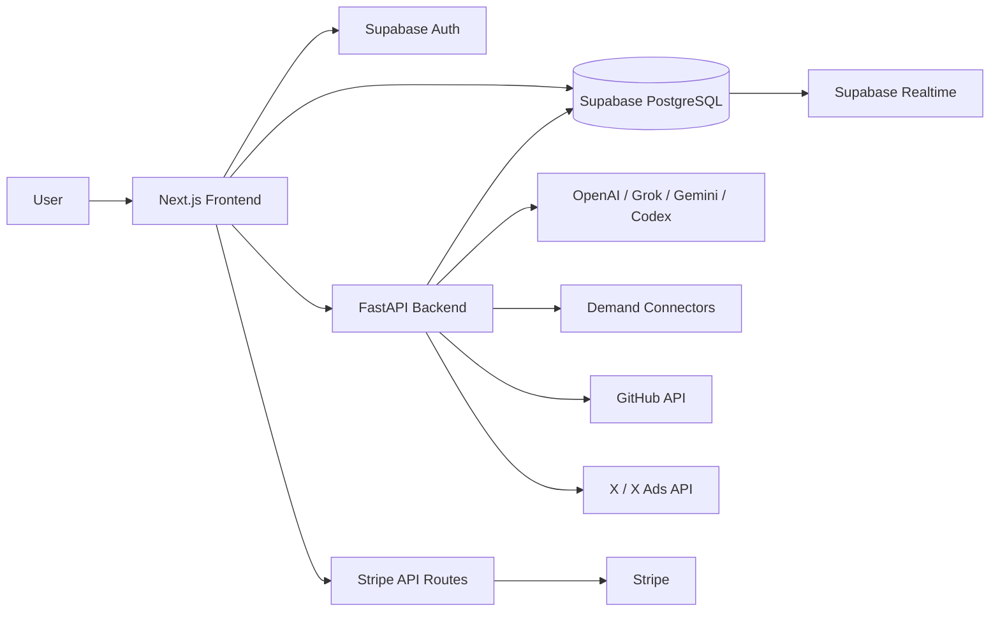

# AdFlow-AI: Claude Code向けリポジトリガイド

最終更新: 2026-06-18

このファイルは、Claude CodeがAdFlow-AIの目的、現在の実装、主要な設計契約、調査順序を短時間で把握するための入口です。

現在の実装範囲、Productionとの差分、リリース阻害要因、リリース手順は、
最初に `docs/adflow-ai-release-source-of-truth-ja.md` を確認してください。

## 最初に守ること

1. 現在のコードを最優先の事実とする。
2. `docs` だけを根拠に実装済み・未実装を判断しない。
3. UIの存在だけで機能完成と判断しない。API、DB保存、再取得、状態遷移、外部実行まで追跡する。
4. REAL、MOCK、SYNTHETICを混同しない。
5. 既存の未コミット変更を勝手に戻さない。
6. Supabase migrationは番号順で管理し、既存migrationを過去に遡って書き換えない。
7. 外部サービス未設定時に、固定成功レスポンスや実結果に見えるモックを追加しない。
8. 変更後は対象テストだけでなく、Frontend型チェックまたはBackendテストを実行する。

## プロダクト概要

AdFlow-AIは、広告とランディングページの改善業務を一つの追跡可能なワークフローとして管理するWebアプリです。

中心となる考え方は、広告運用を単発のAI提案や分析レポートで終わらせず、次のループとして保存・再利用することです。

```text
Demand Discovery
  -> Evidence / Competitor Research
  -> Ad-LP Pair Analysis
  -> Improvement
  -> Human Approval
  -> Codex Task / GitHub PR / X Ads Publish
  -> Outcome
  -> Experiment / Measurement
  -> Learning
  -> Next Improvement
```

プロダクトの現在のポジショニングは「Build Decision Platform」ではなく、**Ad Optimization Workspace / 広告改善ワークスペース**です。

主な対象ユーザー:

- SaaSチーム
- 広告・グロース・マーケティング担当者
- 複数案件を運用する代理店
- AI提案を人間の承認付きで運用したいチーム

提供しない価値:

- 売上や成功の保証
- 未来予測
- 根拠のないAI自動判断
- 人間の承認を排除した無条件の本番適用

## 技術構成



| 領域 | 実装 |
| --- | --- |
| Frontend | Next.js 15 App Router、React 19、TypeScript、Tailwind CSS |
| UI / State | shadcn/ui系コンポーネント、TanStack Query、Zustand、Recharts |
| Backend | FastAPI、Pydantic、Python 3.12 |
| DB / Auth | Supabase PostgreSQL、Supabase Auth、RLS |
| Realtime | Supabase Realtime |
| Billing | Stripe Checkout、Billing Portal、Webhook |
| AI | OpenAI、xAI Grok、Google Gemini、Codex CLI / Manual Execution |
| External Data | Google Custom Search、Firecrawl、Reddit、X |
| Development | GitHub OAuth / REST API |

## ディレクトリ構成

```text
frontend/
  app/                    Next.js routes、Route Handlers
  components/             UI、marketing、billing、X Ads等
  hooks/                  TanStack Query hooks、UI hooks
  lib/api/                FastAPIクライアント
  lib/types/              Frontend共有型
  lib/i18n/               LP等の専用コピー
  locales/                アプリ全体の日英翻訳
  e2e/                    Playwright tests
  lp/                     LPのpositioning/content/UI仕様

backend/
  api/main.py             FastAPIエンドポイントと依存構築
  core/config.py          環境設定
  services/               ドメインサービス
  tests/                  Backend tests
  Dockerfile              Python 3.12 / Uvicorn

supabase/
  migrations/             DB schema、RLS、trigger、RPC

docs/
  adflow-ai-current-state.md
  adflow-ai-complete-spec.md
  phase1-audit-report.md ... phase8-audit-report.md
  ui-pages/               画面単位の資料
```

## 主要ドメイン

### Project / Operations

- Projectの作成、編集、複製、一時停止、アーカイブ、復元、論理削除
- Global Search
- Notification Center
- Background Jobs
- Activity Timeline
- Saved Views
- Workspace Settings
- Supabase Realtimeとポーリングフォールバック

主な画面: `/projects`, `/projects/[projectId]`, `/operations`, `/dashboard`

### Demand Discovery / Demand Intelligence

- 調査セッション作成、メッセージ、履歴、再開、検索、お気に入り
- Web検索や外部コネクタからSignalを収集
- Evidence、Competitor、Demand Score、Learning Contextを保存
- Connector障害は`unavailable`や`failed`として扱う

主な画面: `/demand-discovery`, `/pairs/[pairId]`

重要:

- `data_source_type`は`REAL | SYNTHETIC`
- Evidence EngineはREALかつURLを持つSignalを対象にする
- 合成検索需要、市場推定、決定論的Embeddingなどを実測値として表示しない
- RedditはAPI審査と認証情報が必要

### Ad / LP / Pair Analysis

- 広告、LP、広告・LP Pairを登録
- 広告の訴求とLPの整合性を同じ改善単位で分析
- 分析結果からImprovementを生成

主な画面: `/ads`, `/lps`, `/pairs`, `/ad-optimization/[projectId]`

### AI Orchestration / Improvement

- 複数AI Providerによる提案とレビュー
- Human Approvalを含む状態管理
- 状態変更履歴をDBへ保存

Improvement状態:

```text
GENERATED -> APPROVED -> APPLY_READY -> APPLIED
GENERATED -> REJECTED
APPROVED  -> REJECTED
APPLY_READY -> FAILED
FAILED -> APPLY_READY
```

重要なデータ契約:

- `provider_type`: `REAL | MOCK`
- `source_provider`: 実際のProvider
- `failure_reason`: フォールバック理由
- MOCK結果はScorecard、Outcome Learning、Recommendation Learningの対象外
- Codex TaskやOutcomeへ進める改善は原則`APPLY_READY`かつ`REAL`

主な画面: `/orchestration`, `/improvements`, `/improvements/[improvementId]`

### Codex

- Apply ReadyのImprovementからCodex Taskを作成
- 一覧、詳細、状態履歴、実行ログ、再実行、キャンセル
- 実行モードを明示

実行モード:

- `REAL_EXECUTION`: Codex CLI等を実行
- `MANUAL_EXECUTION`: 外部実行結果を人間が登録
- `MOCK`: 本番デフォルト禁止

Task状態:

```text
CREATED -> QUEUED -> RUNNING -> SUCCEEDED
RUNNING -> FAILED
FAILED -> QUEUED
CREATED | QUEUED | RUNNING -> CANCELLED
SUCCEEDED -> PR_CREATED
SUCCEEDED -> OUTCOME_CREATED
PR_CREATED -> OUTCOME_CREATED
```

主な画面: `/codex-tasks`, `/codex-tasks/[taskId]`

REAL_EXECUTIONは選択済みRepositoryを実行ごとの一時ディレクトリへcloneし、終了時に削除する。Codex子プロセスにはGitHub、Supabase、Stripe等のsecretsを渡さない。

### GitHub

- GitHub App installation接続
- Repository選択と権限確認
- Installation Access Tokenは都度発行し、長期保存しない
- `adflow/{improvement_id}`形式のBranch
- CommitとPull Request作成
- PR状態同期と監査イベント

PR状態: `CREATING | OPEN | MERGED | CLOSED | FAILED`

主な画面: `/prs`, `/settings`

### Outcome / Learning

- Improvement、Codex Task、GitHub PRからOutcomeを作成
- Before / After、測定期間、根拠、改善率を保存
- 測定結果をLearning Dataへ変換
- REALなImprovement由来の測定済みOutcomeだけを学習へ利用

Outcome状態:

```text
DRAFT
PENDING_MEASUREMENT
MEASURING
SUCCESS
PARTIAL_SUCCESS
NO_IMPACT
FAILED
ARCHIVED
```

主な画面: `/outcomes`, `/outcomes/[outcomeId]`

### Experiment / Measurement

- Experiment、複数Variant、Traffic Allocation
- LP Runtime Eventと広告指標の収集
- Measurement集計、Winner Detection、Confidence
- Experiment Learning、Insight、Revenue Impact

Experiment状態:

```text
DRAFT -> READY -> RUNNING
RUNNING -> PAUSED -> RUNNING
RUNNING | PAUSED -> COMPLETED
READY | RUNNING | PAUSED -> FAILED
DRAFT | READY | PAUSED | COMPLETED | FAILED -> ARCHIVED
```

主な画面: `/experiments`, `/experiments/[experimentId]`

注意:

- Revenue Impactは保存済みデータを使った推定差分であり、売上保証ではない
- 統計判定は実装範囲を確認し、高度な統計機能を推測で説明しない

### X Ads

- OAuthまたは手動接続
- Account、広告、指標同期
- Publish Request、Human Approval、公開、Event保存
- Experiment / Outcomeへの接続

主な画面: `/ad-optimization/[projectId]`, `/settings`

### Billing / Credits

- Stripe Checkout
- Billing Portal
- Webhook冪等処理
- 月次Credit、追加購入、消費、返金台帳
- Checkout Success画面はStripe Sessionの完了状態を検証

重要:

- 外部処理とCredit消費にはidempotencyを使う
- 外部処理失敗時の補償処理を壊さない
- Stripe Webhookの重複イベントを二重反映しない

## LPの現在の方針

トップページは「需要予測ツール」ではなく「広告改善ワークスペース」として説明します。

コピーとUIの根拠:

1. `frontend/lp/LP_POSITIONING_SPE.md`
2. `frontend/lp/LP_CONTENT_SPEC.md`
3. `frontend/lp/LP_UI_IMPLEMENTATION_SPEC.md`
4. `frontend/lib/i18n/lp.ts`
5. `frontend/components/marketing/HomePageClient.tsx`

LPで強調するもの:

- Evidence
- Ad-LP Pair Analysis
- Improvement Review
- Execution
- Outcome
- Learning
- 改善履歴を再利用可能な知識として残すこと

LPで避けるもの:

- 成功予測、売上保証
- 根拠のないAIマーケティング表現
- 実在しない機能
- futuristicなAIイラスト
- Build Decision Platformという旧ポジショニング

## 主な画面

| Route | 内容 |
| --- | --- |
| `/` | 公開LP |
| `/dashboard` | 運用・Outcome・Experiment概要 |
| `/projects` | Project管理 |
| `/demand-discovery` | Demand Discovery |
| `/ad-optimization` | 広告最適化Project |
| `/ad-optimization/[projectId]` | 広告、LP、Pair、X Ads、Experiment |
| `/improvements` | Improvement一覧と状態管理 |
| `/codex-tasks` | Codex Task管理 |
| `/prs` | GitHub PR管理 |
| `/outcomes` | OutcomeとLearning |
| `/experiments` | ExperimentとExecutive指標 |
| `/operations` | 通知、Job、Activity、Saved View |
| `/settings` | GitHub、X Ads、Billing、Workspace設定 |

## DB変更時の注意

- migrationは`supabase/migrations`へ新規追加する
- RLSを有効化し、ユーザー所有データの境界を確認する
- Backendはservice roleを使う経路があるため、API側でも必ずuser_idを絞る
- 状態遷移はBackendだけでなくDB trigger / constraintでも保護されている
- 状態名の大小文字を勝手に変えない
- 監査履歴、notification、activity、background jobのtriggerへの影響を確認する

主要テーブル群:

- Core: `ad_projects`, `twitter_ads`, `landing_pages`, `ad_lp_pairs`
- AI: `ai_agents`, `ai_agent_results`, `improvement_status_history`
- Codex: `codex_task_prompts`, `codex_task_executions`
- GitHub: `github_connections`, `github_repository_selections`, `github_pull_requests`, `github_pr_events`
- Demand: `demand_discovery_sessions`, `demand_intelligence_runs`, `demand_intelligence_signals`, `demand_evidence`, `demand_competitors`, `demand_scores`, `demand_learning_contexts`
- Outcome: `improvement_outcomes`, `outcome_status_history`, `outcome_learning_data`
- Experiment: `ad_ab_tests`, `ad_ab_test_variants`, `lp_analytics_events`, `experiment_measurements`, `experiment_evaluations`, `experiment_learning_data`, `revenue_impacts`
- Operations: `user_notifications`, `background_jobs`, `activity_events`, `saved_views`, `user_workspace_settings`
- Billing: `user_billing_profiles`, `user_credit_balances`, `credit_transactions`, `stripe_webhook_events`

## 開発コマンド

### Frontend

```powershell
cd frontend
npm install
npm run dev
npm run lint
npm run build
npm run test:phase1
npm run test:e2e
```

`npm run lint`はESLintではなく、`next typegen && tsc --noEmit`です。

FrontendとBackendをまとめて起動・停止:

```powershell
.\scripts\start-local.ps1
.\scripts\stop-local.ps1
```

### Backend

リポジトリルートから実行:

```powershell
py -3.12 -m pip install -r backend/requirements.txt
py -3.12 -m uvicorn backend.api.main:app --reload --port 8000
py -3.12 -m pytest backend/tests
```

Docker:

```powershell
docker build -t adflow-ai-backend backend
docker run --rm -p 8080:8080 --env-file backend/.env.local adflow-ai-backend
```

Health check:

```text
GET /health
```

## 環境変数

秘密情報をコードやドキュメントへ直接記載しない。完全な一覧は以下を参照:

- `frontend/.env.example`
- `backend/.env.example`

主要グループ:

- Supabase: `SUPABASE_URL`, `SUPABASE_SERVICE_ROLE_KEY`, Frontend public keys
- Stripe: Secret、Webhook Secret、Price IDs
- AI: OpenAI、Grok、Gemini
- Codex: executable、workspace、timeout
- GitHub: OAuth Client、callback、token encryption key
- X Ads: Consumer key/secret、callback、token encryption key
- Demand: Google Custom Search、Firecrawl、Reddit、X Bearer Token
- Cron: LP snapshot secretと対象Project / Pair

## 調査・実装の推奨順序

1. 対象画面を`frontend/app`から特定する。
2. 使用hookを`frontend/hooks`で確認する。
3. API clientを`frontend/lib/api`で確認する。
4. FastAPI endpointを`backend/api/main.py`で確認する。
5. Domain serviceを`backend/services`で確認する。
6. Repositoryの保存・取得処理を確認する。
7. 関連migration、constraint、trigger、RLSを確認する。
8. 対象のBackend test / Playwright testを確認する。
9. 実装後に保存、再取得、ページ再読込後の維持を検証する。

## 完了判定

次の状態では「実装済み」と報告しない:

- UIだけ存在する
- APIが固定レスポンスを返す
- DBへ保存されない
- 保存後に再取得できない
- ページ再読込で状態が消える
- 外部APIを呼ばず`planned`だけ返す
- MOCKをREALとして表示する
- SYNTHETICを実測値として表示する
- TODOコメントだけで処理がない

完了報告には、変更ファイル、実行したテスト、未確認の外部依存を明記する。

## 現在の既知制限

- 外部サービスの本番権限、Rate Limit、長時間障害試験は環境依存
- Reddit ConnectorはAPI利用審査と認証情報が必要
- Google Suggest、Related Search、PAA、YouTubeコメント専用取得は未確認
- Experimentの連続値指標に高度な分散推定はない
- 複数Backend instanceで定期評価を動かす場合は排他制御が必要
- LP public tracking tokenのローテーション・失効UIは未確認
- Team / Organization単位の権限管理は未確認

## 参照ドキュメント

コード確認後の補助資料として使う:

- `docs/adflow-ai-release-source-of-truth-ja.md`
- `docs/adflow-ai-current-state.md`
- `docs/adflow-ai-product-overview-ja.md`
- `docs/adflow-ai-complete-spec.md`
- `docs/phase1-audit-report.md` ～ `docs/phase8-audit-report.md`
- `docs/unimplemented-features-audit.md`
- `docs/ui-pages/`

一部ドキュメントは更新時期や文字エンコーディングに差がある。内容がコードと矛盾する場合は、Frontend、Backend、migration、testの接続結果を優先する。
