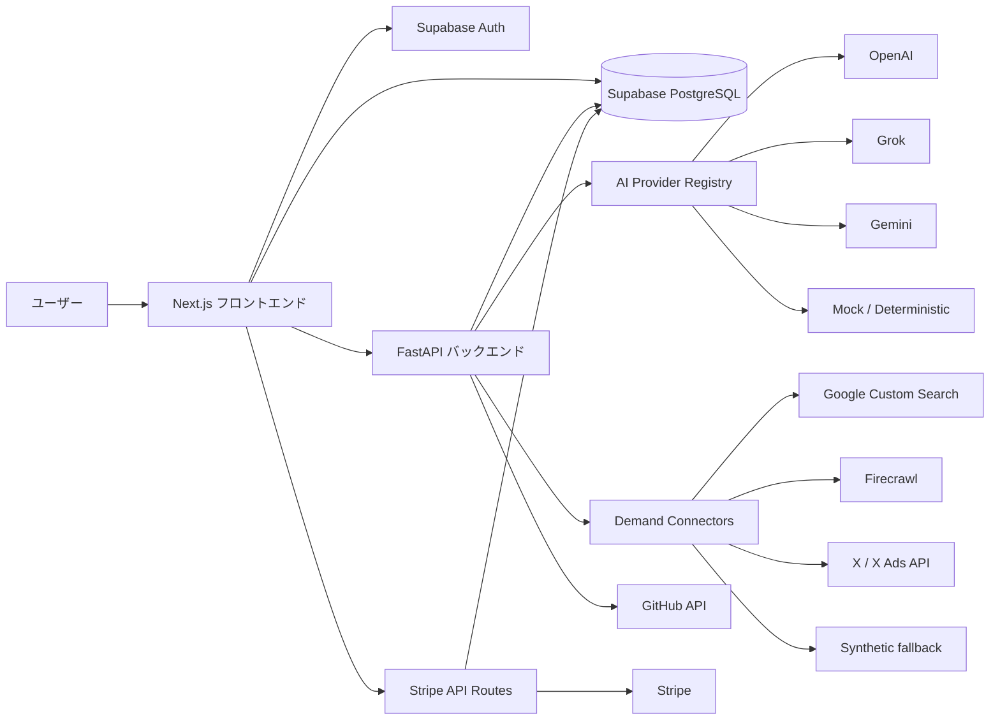
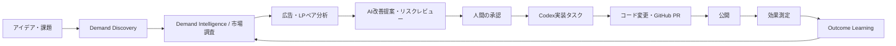

# AdFlow-AI プロダクト概要

本書は、AdFlow-AIリポジトリの `frontend`、`backend`、`supabase`、既存ドキュメントを照合し、第三者がプロダクトの目的、現在の実装範囲、未完成部分、目標像を理解できるようにまとめた技術監査ベースの概要です。

「実装済み」はコード上でUI、API、保存、取得、実行処理の接続を確認できた範囲を指します。外部サービスを利用する機能については、実際の認証情報を用いた本番接続試験までは本調査に含みません。「最終完成形」と「ロードマップ」は現在の実装済み機能ではなく、既存コードと仕様書が示す方向性を分離して記載しています。

# AdFlow-AIとは

## このアプリが解決しようとしている課題

AdFlow-AIは、広告とランディングページ（LP）を別々の制作物ではなく、1つのコンバージョン経路として登録・分析する広告改善オペレーションサービスです。

コードベースが扱っている主な課題は、広告文とLPの訴求がずれること、改善履歴や判断根拠が残らないこと、AI提案をそのまま適用するリスク、改善後の結果が次回分析へ反映されないことです。また、インターネット上の不満、欲求、比較、競合への不満などを需要シグナルとして収集し、広告・LP改善の仮説材料にする仕組みを持っています。

Demand Intelligenceは、需要や売上を保証する機能ではありません。コードと仕様書では、根拠を整理して意思決定を補助する仕組みとして位置付けられています。

## 対象ユーザー

- SaaS、デジタル商品、オンラインサービスの広告運用担当者
- 広告とLPを継続的に改善するマーケター、プロダクトチーム
- 複数案件を扱う広告代理店や運用支援担当者
- AI提案を人間のレビュー付きで利用したいチーム
- 需要調査、広告公開、改善結果の記録を一つの運用フローにまとめたい利用者

## 想定利用シーン

利用者はプロジェクトを作り、広告とLPを登録してペアにします。そのペアを分析し、AI提案、需要シグナル、リスクレビューを確認します。採用する改善案を選び、実装後の指標を成果として記録し、次回分析へ反映します。

別の入口としてDemand Discoveryがあり、事業アイデア、顧客課題、市場テーマをチャット形式で入力して調査結果を得られます。また、X Adsを接続して広告データを同期し、承認済み公開要求をXへ公開する経路も実装されています。

## コアコンセプト

1. **広告とLPをペアで扱う**: クリック前後の訴求、CTA、オファー、ターゲット整合性を同じ改善単位で評価する。
2. **需要を断定せず、証拠を整理する**: 外部ソースや合成シグナルを構造化し、改善仮説の根拠として扱う。
3. **提案とリスクレビューを分離する**: 複数AIエージェントの提案とレビュー結果を保存し、人間が判断状態を設定する。
4. **改善結果を記録する**: 実装前後の指標と学習メモを保存し、次回分析や需要学習へ戻す。
5. **実行コストをクレジットで管理する**: 分析、需要調査、X Ads同期・公開などの処理ごとにクレジットを消費する。

## このアプリが目指している価値

コードと仕様書が示す価値は、広告調査ツール、AI文章生成ツール、広告管理画面を個別に提供することではなく、「需要の発見から、改善提案、人間の承認、実装、公開、効果測定、学習まで」を一つの監査可能な改善ループとして管理することです。

ただし現在は、調査・分析・保存・X Ads公開・成果記録の多くが実装されている一方、改善承認からコード変更、GitHub PR、Codex実行へ進む経路は未完成です。

# AdFlow-AI全体アーキテクチャ

## フロントエンド

Next.js 15 App Router、React 19、TypeScript、Tailwind CSSで構成されています。TanStack QueryをAPI・Supabaseデータ取得に、Zustandを一部UI状態に、Rechartsをチャート表示に利用しています。認証後の主要画面は、ダッシュボード、広告最適化、需要調査、広告・LP・ペア、改善提案、結果、AIオーケストレーション、課金、設定です。

## バックエンド

FastAPIを中心に、広告・LPペア分析、Demand Discovery、Demand Intelligence、AIオーケストレーション、成果管理、X Ads連携、課金情報取得、全体ワークフローを提供しています。Pydanticで入出力モデルを定義し、Supabase Repositoryを通じてデータを保存します。

## DB

Supabase PostgreSQLを利用しています。認証ユーザー単位のRLSを前提とし、プロジェクト、広告、LP、分析、需要シグナル、AI実行、成果、X Ads接続、課金、クレジットなどを保存します。

## 外部サービス

コード上で利用が確認できる外部サービスは、Supabase、Stripe、OpenAI、xAI Grok、Google Gemini、Google Custom Search、Firecrawl、X API / X Ads API、GitHub API、Vercel Analyticsです。認証情報未設定時や外部API失敗時に、モックまたは合成結果へフォールバックする経路があります。

## AIプロバイダー

OpenAI、Grok、Gemini、Mock Providerを登録し、タスク種別とスコアカードを使ってエージェントを選択します。提案生成、LPレビュー、リスクレビュー、分析診断などを分離しています。ただし既定値はモックであり、実プロバイダー失敗時にもモック結果を返すため、実AI結果との識別が不十分です。CodexエージェントはMock Providerに割り当てられています。

## 認証

Supabase Authを利用します。フロントエンドはSupabaseセッションを使い、FastAPIの主要APIはBearer tokenを検証してユーザーIDを確定します。Google OAuthログインのコードも存在します。

## 課金

Stripe Checkout、Billing Portal、Webhook、月額プラン、追加クレジット購入が実装されています。Webhookから契約状態とクレジットを更新し、バックエンド処理時にクレジットを消費します。一方、成功画面のCheckoutセッション検証、返金・支払い失敗時の調整、取引履歴UIは不足しています。

## 広告媒体連携

X Ads向けにOAuth接続、手動トークン接続、検証、アカウント取得、広告・指標同期、公開要求、承認、公開が実装されています。接続解除はDB状態変更のみで、X側トークンの失効処理は確認できません。

## GitHub連携

GitHub APIを使ったPR作成クライアントは存在します。ただし既存のhead branchを前提とし、ブランチ作成、ファイル変更、コミット作成は計画オブジェクトを返すだけです。改善提案UIとPR一覧UIにも接続されていません。

## その他連携

Google Custom SearchとFirecrawlは需要調査ソースとして使用されます。X需要コネクタとWebページコネクタは実装ファイルが存在しますが、現在の需要調査実行経路には接続されていません。

# 現在実装済み機能

以下の実装率は、UI、API、DB、保存、取得、実行処理、外部連携、エラー処理の充足度をコード監査上の目安として評価したものです。

## Demand Discovery

### 概要

事業アイデア、顧客課題、市場テーマをチャット形式で入力し、需要調査を実行する入口です。

### 現在実装済み

セッション作成、メッセージ追加、調査要求、調査結果保存、結果表示が実装されています。結果には課題、欲求、競合、仮説などが含まれます。過去セッション一覧、再開、削除はUI未実装です。

### 使用テーブル

`demand_discovery_sessions`、`demand_research_requests`

### 使用API

`/demand-discovery/sessions`、`/demand-discovery/sessions/{session_id}`、`/messages`、`/research`、`/demand-discovery/analyze`

### 使用画面

`/demand-discovery`

### 実装率推定

**75%**。会話から調査結果を得る主経路は成立していますが、保存したセッションを後から管理できません。

## Demand Intelligence

### 概要

外部ソースや合成ソースから需要シグナルを収集し、クラスタ、検証、適合度、検索需要、推定市場規模、監視情報へ構造化する機能です。

### 現在実装済み

実行、シグナル保存、埋め込み、クラスタリング、検証、Solution Fit、スナップショット、Evidence表示、Outcome Learningが実装されています。検索需要、市場規模、埋め込み、一部成長率は合成値または決定論的計算です。

### 使用テーブル

`demand_intelligence_runs`、`demand_intelligence_signals`、`demand_intelligence_embeddings`、`demand_intelligence_clusters`、`demand_signal_validations`、`demand_solution_fits`、`demand_source_runs`、`demand_connector_logs`

### 使用API

`/demand-intelligence/run`、`/demand-intelligence/runs/{run_id}`、`/signals`、`/clusters`、`/validations`、`/solution-fits`、`/evidence`

### 使用画面

`/pairs/[pairId]` のDemand Intelligence関連タブ

### 実装率推定

**68%**。パイプラインと保存・表示は広範ですが、中核データの一部が実測ではなく、未接続コネクタもあります。

## Market Research

### 概要

検索、Webページ、需要シグナルから市場課題、関連テーマ、検索需要の方向性、市場規模の参考値を整理します。

### 現在実装済み

Google Custom Search、Firecrawl検索、クエリ生成、検索需要参考スコア、市場規模推定、需要調査サマリーが実装されています。Google Suggest、Related Search、PAA、正確な検索ボリューム、市場データ提供会社との連携は確認できません。

### 使用テーブル

`demand_search_signals`、`demand_market_size_estimates`、`demand_intelligence_signals`、`demand_source_runs`

### 使用API

`/demand-intelligence/runs/{run_id}/search-demand`、`/market-size`、Demand Discovery調査API

### 使用画面

`/demand-discovery`、`/pairs/[pairId]`

### 実装率推定

**55%**。調査結果の構造化はできますが、検索需要と市場規模は参考用の合成推定です。

## Competitor Analysis

### 概要

競合、代替手段、競合への不満、未解決ニーズを需要調査結果から抽出する機能です。

### 現在実装済み

検索クエリに比較・代替・競合レビューを含め、競合ギャップをDemand DiscoveryとDemand Intelligenceのサマリーに保存・表示します。専用の競合企業管理、競合広告収集、価格・機能比較、継続監視はありません。

### 使用テーブル

専用テーブルはありません。`demand_intelligence_signals`、`demand_intelligence_clusters`、`demand_discovery_sessions` のJSON結果を利用します。

### 使用API

Demand Discovery調査API、Demand Intelligence実行・取得API

### 使用画面

`/demand-discovery`、`/pairs/[pairId]`

### 実装率推定

**50%**。競合関連の調査結果は得られますが、独立した競合分析プロダクトとしての管理・比較機能はありません。

## Product Review Analysis

### 概要

レビューサイト、アプリストア、競合レビューなどに含まれる不満・欲求を需要シグナルとして扱う領域です。

### 現在実装済み

レビューを想定したソース種別、検索語、シグナル分類が定義され、Firecrawlや検索結果から取得した内容を需要分析へ取り込めます。Amazon、楽天、価格.com、App Store、Google Play等の専用レビューAPI・コネクタは確認できません。

### 使用テーブル

`demand_intelligence_signals`、`demand_source_runs`、`demand_connector_logs`

### 使用API

Demand Intelligence実行・シグナル取得・Evidence取得API

### 使用画面

`/pairs/[pairId]`

### 実装率推定

**40%**。レビューを検索由来の需要証拠として扱えますが、専用収集・集計・評価分析は未実装です。

## Ad Analysis

### 概要

登録広告の指標と広告・LPペアを分析し、改善提案とリスクを生成します。

### 現在実装済み

広告登録・同期、指標保存、ペア分析、AI提案、レビュー、分析履歴、改善案表示が実装されています。一方、分析用の広告時系列は同一値の複製を含み、デバイス、ターゲティング、配信面の詳細は利用していません。

### 使用テーブル

`twitter_ads`、`ad_lp_pairs`、`analysis_runs`、`ai_orchestration_runs`、`ai_agent_results`

### 使用API

`/analysis/pairs/{pair_id}/run`、`/runs`、`/latest`、`/ad-optimization/projects/{project_id}/analysis/run`

### 使用画面

`/ads`、`/ads/[adId]/edit`、`/pairs/[pairId]`、`/campaigns/[campaignId]`

### 実装率推定

**65%**。保存・分析・提案は接続済みですが、実時系列と広告配信コンテキストが不足しています。

## LP Analysis

### 概要

LPの登録内容、広告との整合性、CTA、オファー、改善提案を扱います。

### 現在実装済み

LP CRUD、URLからのHTML文字列抽出、LPバージョン、ペア分析、最新保存値の表示があります。実ブラウザレンダリング、速度計測、アクセス解析、行動分析、FAQ自動抽出は確認できません。

### 使用テーブル

`landing_pages`、`landing_page_versions`、`ad_lp_pairs`、`analysis_runs`

### 使用API

`/asset-import/lp-from-url`、ペア分析API

### 使用画面

`/lps`、`/lps/new`、`/lps/[lpId]/edit`、`/lp`、`/pairs/[pairId]`

### 実装率推定

**38%**。登録情報を使ったAIレビューはできますが、実サイト計測を伴うLP分析ではありません。

## AI Orchestration

### 概要

分析タスクを複数AIエージェントへ振り分け、提案、レビュー、判断状態、評価を保存します。

### 現在実装済み

エージェント定義、実行計画、複数結果保存、提案比較、リスクレビュー、判断状態、スコアカードが実装されています。実AI失敗時にモックへ透過的に切り替わる点と、エージェント管理UIがない点が制限です。

### 使用テーブル

`ai_agents`、`ai_orchestration_runs`、`ai_agent_results`、`ai_agent_scorecards`

### 使用API

`/orchestration/agents`、`/runs`、`/runs/{run_id}/results`、`/scorecards`、`/results/{result_id}/decision`

### 使用画面

`/orchestration`、`/pairs/[pairId]`

### 実装率推定

**70%**。オーケストレーション基盤は動作しますが、実結果とモック結果の品質境界が弱い状態です。

## Agent Routing

### 概要

タスク種別、媒体、指標、過去スコアに応じて利用するAIエージェントを選ぶ機能です。

### 現在実装済み

ルールベースのルーティング、低スコア時の追加エージェント、判断結果を使ったスコアカード再計算が実装されています。ルーティングルールの編集UIや、モック結果を学習対象から除外する仕組みは確認できません。

### 使用テーブル

`ai_agents`、`ai_agent_scorecards`、`ai_agent_results`

### 使用API

AI Orchestration関連API

### 使用画面

`/orchestration`、`/pairs/[pairId]`

### 実装率推定

**72%**。ルーティングと評価更新はありますが、運用制御とデータ品質管理が不足しています。

## Improvement System

### 概要

分析結果から改善提案を表示し、人間が採否を判断して次の実行へ進める機能です。

### 現在実装済み

AI提案、差分案、レビュー警告、判断状態API、`apply_ready` 制約が実装されています。ただし改善提案専用画面のApprove、Reject、Create PRは固定レスポンスまたは通知だけで、バックエンドへ接続されていません。

### 使用テーブル

`analysis_runs`、`ai_agent_results`、`change_history`

### 使用API

ペア分析API、`/orchestration/results/{result_id}/decision`、`/orchestration/results/{result_id}/codex-task`

### 使用画面

`/improvements`、`/improvements/[improvementId]`、`/pairs/[pairId]`

### 実装率推定

**55%**。提案生成とペア詳細上の判断はありますが、改善専用UIの主要操作は疑似実装です。

## Improvement Outcomes

### 概要

改善実装前後の指標、結果状態、学習メモを保存し、次回分析へ戻す機能です。

### 現在実装済み

成果の作成、一覧、更新、前後差分、結果サマリー、分析コンテキスト利用、Demand Outcome Learningとの接続が実装されています。削除機能はなく、通常の改善では手入力が中心です。X Ads公開後の同期では成果指標を更新する経路があります。

### 使用テーブル

`improvement_outcomes`、`demand_outcome_learning_links`

### 使用API

`/outcomes`、`/outcomes/pairs/{pair_id}`、`/outcomes/{outcome_id}`、AI結果・Codexタスクからの成果作成API

### 使用画面

`/pairs/[pairId]`、`/results`、`/dashboard`、`/ad-optimization/[projectId]`

### 実装率推定

**75%**。記録と再利用は成立していますが、自動計測とライフサイクル管理が不足しています。

## GitHub Integration

### 概要

承認された改善をコード変更とPRレビューへつなぐための連携領域です。

### 現在実装済み

GitHub APIによるPR作成クライアントと、全体ワークフロー内のPR作成試行があります。既定プロバイダーはメモリ実装です。ブランチ・コミット作成は計画のみで、PR結果保存、一覧取得、改善UI接続はありません。

### 使用テーブル

専用のPR保存テーブルはありません。

### 使用API

バックエンド内部のGitHubクライアント、`/workflow/run`

### 使用画面

`/prs` は存在しますが、取得関数が常に空配列を返します。

### 実装率推定

**28%**。外部PR APIクライアントはありますが、ユーザーが完結して利用できるフローではありません。

## Codex Integration

### 概要

`apply_ready` になった改善提案を、コード実装用タスク文面へ変換する領域です。

### 現在実装済み

対象提案の状態検証、Codex向けタスク文面生成、DB保存、クレジット消費、タスクから成果ドラフトを作るAPIがあります。Codexへの送信、コード変更、実行結果取得、タスク一覧・詳細・状態管理はありません。CodexプロバイダーはMock Providerです。

### 使用テーブル

`codex_task_prompts`、`ai_agent_results`、`improvement_outcomes`

### 使用API

`/orchestration/results/{result_id}/codex-task`、`/orchestration/codex-tasks/{task_id}/outcome`

### 使用画面

`/pairs/[pairId]` から生成できますが、専用管理画面はありません。

### 実装率推定

**25%**。タスク生成・保存までで、Codex連携や実装実行は未実装です。

## X Ads Integration

### 概要

X Adsアカウントを接続し、広告と指標をAdFlow-AIへ同期する機能です。

### 現在実装済み

OAuth開始・コールバック、手動接続、暗号化トークン保存、検証、アカウント取得、詳細同期、広告・指標保存が実装されています。Revokeはローカル状態変更のみです。

### 使用テーブル

`x_ads_connections`、`x_ads_oauth_sessions`、`x_ads_accounts`、`x_ads_metric_snapshots`、`twitter_ads`

### 使用API

`/integrations/x-ads/connections`、`/oauth/start`、`/oauth/callback`、`/verify`、`/revoke`、`/accounts`、`/detailed-sync`

### 使用画面

`/ad-optimization`、`/ad-optimization/[projectId]`、X Ads操作パネル

### 実装率推定

**82%**。接続・同期の主経路はありますが、外部失効と運用監査表示が不足しています。

## X Ads Publish

### 概要

改善案をX Ads向け公開要求として作成し、人間の承認後にXへ投稿・広告紐付けする機能です。

### 現在実装済み

公開要求作成、承認・却下、承認済み要求の公開、投稿、promoted tweet紐付け、イベント保存、広告・A/Bテスト・成果レコード作成が実装されています。line item IDは手入力で、公開イベント表示や専用リトライUIはありません。

### 使用テーブル

`x_ads_publish_requests`、`x_ads_publish_events`、`twitter_ads`、`ad_ab_tests`、`ad_ab_test_variants`、`improvement_outcomes`

### 使用API

`/integrations/x-ads/publish-requests`、`/{request_id}/approval`、`/{request_id}/publish`

### 使用画面

X Ads操作パネル、公開要求作成・操作コンポーネント

### 実装率推定

**78%**。外部公開処理は存在しますが、公開運用を支える選択・監査・復旧UIが不足しています。

## A/B Testing

### 概要

広告改善のコントロールとバリアントを登録し、状態と現在指標を比較する機能です。

### 現在実装済み

テスト作成、バリアント保存、状態変更、一覧、暫定勝者表示があります。媒体上の配信分割、期間制御、継続的指標スナップショット、統計的有意差、正式勝者確定はありません。開始・完了操作は主に状態変更です。

### 使用テーブル

`ad_ab_tests`、`ad_ab_test_variants`、`twitter_ads`

### 使用API

`/ad-optimization/projects/{project_id}/ab-tests`、`/ad-optimization/ab-tests/{test_id}/status`

### 使用画面

`/ad-optimization/[projectId]`

### 実装率推定

**42%**。比較データモデルはありますが、実験運用エンジンとしては未完成です。

## Project Management

### 概要

広告、LP、ペア、分析、成果をプロジェクト単位で整理する機能です。

### 現在実装済み

プロジェクト作成、一覧、参照、プロジェクト別広告・LP・ペア・成果・履歴表示があります。更新・削除用フックは存在しますがUIから呼ばれません。`/projects/[projectId]` は固定説明中心です。

### 使用テーブル

`ad_projects` と、`project_id` を持つ広告・LP・ペア・成果関連テーブル

### 使用API

Supabase直接CRUD、`/ad-optimization/projects`、`/{project_id}`、`/assets`、`/recommendations`、`/results`

### 使用画面

`/projects`、`/projects/[projectId]`、`/ad-optimization`、`/ad-optimization/[projectId]`

### 実装率推定

**60%**。基本的な作成・一覧・集約表示はありますが、管理CRUDと詳細画面が不完全です。

## Billing

### 概要

月額プラン契約と追加クレジット購入をStripeで処理する機能です。

### 現在実装済み

料金表示、JPY/USDプラン、Checkout、追加クレジットCheckout、Billing Portal、Webhook、契約プロフィール保存が実装されています。成功ページはセッションを検証せず、返金・支払い失敗時の調整処理も不足しています。

### 使用テーブル

`user_billing_profiles`、`credit_transactions`、`user_credit_balances`

### 使用API

`/api/stripe/create-checkout-session`、`/api/stripe/create-credit-checkout-session`、`/api/stripe/webhook`、`/api/billing/portal`、`/billing/me`

### 使用画面

`/pricing`、`/billing/success`、`/billing/cancel`、`/settings`

### 実装率推定

**78%**。主要な購入・契約経路はありますが、支払い状態の確認と例外処理が不足しています。

## Credit System

### 概要

分析や外部処理の実行コストをユーザー単位のクレジットで管理します。

### 現在実装済み

残高作成、月次付与、購入分追加、消費、残高取得、処理別コスト定義があります。需要調査、分析、X Ads同期・公開、Codexタスク生成等で消費します。取引履歴UI、返金、管理調整、外部処理との完全な原子性はありません。

### 使用テーブル

`user_credit_balances`、`credit_transactions`、`user_billing_profiles`

### 使用API

`/credits/me`、Stripe Webhook、Supabase RPC

### 使用画面

料金・設定・クレジット残高カード

### 実装率推定

**82%**。残高・購入・消費は実装済みですが、監査・返金・整合性管理が不足しています。

## Monitoring

### 概要

需要シグナルとX Ads指標の変化をスナップショットとして保存し、傾向を確認する領域です。

### 現在実装済み

需要スナップショット、trend status、ペア別監視取得、X Ads指標スナップショット、同期時の成果更新があります。需要トレンドの一部は内部算式で、横断監視画面、アラート、コネクタログ・公開イベント表示はありません。

### 使用テーブル

`demand_signal_snapshots`、`x_ads_metric_snapshots`、`demand_connector_logs`、`x_ads_publish_events`

### 使用API

`/demand-intelligence/pairs/{pair_id}/monitoring`、X Ads詳細同期API

### 使用画面

`/pairs/[pairId]` のMonitoring表示

### 実装率推定

**60%**。保存と一部表示はありますが、運用監視・通知基盤としては限定的です。

## Learning System

### 概要

改善成果とAI判断を次回の需要分析・エージェント選択へ反映する仕組みです。

### 現在実装済み

改善成果を分析コンテキストへ戻す処理、需要クラスタと成果のリンク、Outcome Learning再構築、AIエージェントスコアカード更新が実装されています。ただし手動成果が多く、モック・合成結果が評価へ混入し得ます。

### 使用テーブル

`improvement_outcomes`、`demand_outcome_learning_links`、`ai_agent_scorecards`、`ai_agent_results`

### 使用API

`/demand-intelligence/runs/{run_id}/outcome-learning`、`/rebuild`、成果API、オーケストレーション判断API

### 使用画面

`/pairs/[pairId]`、`/orchestration`

### 実装率推定

**65%**。学習ループのデータ構造と再利用経路はありますが、入力品質と自動計測が十分ではありません。

# 未実装機能一覧

以下は将来機能の希望一覧ではなく、現在のUIやコードが示すユーザーフローを完成させるために不足している箇所です。推定工数は1名の既存コード理解済みエンジニアによる概算です。

## 改善提案の承認・却下・PR作成接続

**現状**: 改善専用UIは成功通知を表示しますが、Approveは固定レスポンス、Rejectは保存なし、Create PRは`pr: null`です。  
**不足部分**: 判断APIへの接続、状態再取得、GitHub実行、結果保存。  
**影響**: 中核の「提案から実行」フローが成立しません。  
**優先度**: 最優先  
**推定工数**: 1～2週間

## GitHubブランチ・コミット・PR生成

**現状**: PR APIクライアントはありますが、ブランチとコミットは計画のみで、既存head branchが必要です。  
**不足部分**: ファイル差分適用、ブランチ作成、コミット、PR結果保存・一覧・失敗復旧。  
**影響**: 承認された改善をコードレビューへ渡せません。  
**優先度**: 最優先  
**推定工数**: 3～6週間

## Codexタスク実行・管理

**現状**: タスク文面を生成・保存するだけで、CodexはMock Providerです。  
**不足部分**: 実行連携、一覧・詳細、状態遷移、実行結果、成果・PRへの接続。  
**影響**: 「AI提案から実装」の自動化が途中で止まります。  
**優先度**: 高  
**推定工数**: 4～8週間

## AIモック結果の識別

**現状**: APIキー未設定時や外部API失敗時にモック提案を返し、実プロバイダー名を維持する場合があります。  
**不足部分**: 結果の出所表示、モック結果の保存・学習分離、失敗として扱う運用設定。  
**影響**: 判断、スコアカード、学習データの信頼性が下がります。  
**優先度**: 最優先  
**推定工数**: 3～7日

## 合成需要データの識別と実データ拡張

**現状**: 検索需要、市場規模、埋め込み、成長率、一部需要シグナルが合成値です。  
**不足部分**: UI上の明示、実測データとの分離、X/Webコネクタ接続、必要に応じた実データソース。  
**影響**: 市場判断で参考値を実測値と誤認する可能性があります。  
**優先度**: 最優先  
**推定工数**: 明示対応3～5日、実データ拡張4～10週間

## A/Bテスト実験処理

**現状**: テスト作成と状態変更、現在値比較のみです。  
**不足部分**: 配信分割、期間管理、定期計測、統計判定、勝者確定。  
**影響**: A/Bテストという名称に対して、実験結果の信頼性を担保できません。  
**優先度**: 高  
**推定工数**: 4～8週間

## Stripe成功確認・返金・失敗処理

**現状**: 成功URLへアクセスするとCheckout状態を検証せず成功表示します。  
**不足部分**: セッション検証、返金・支払い失敗・非同期失敗のWebhook処理、クレジット調整。  
**影響**: 課金表示と実支払い状態が不整合になる可能性があります。  
**優先度**: 最優先  
**推定工数**: 1～2週間

## クレジット取引監査と原子性

**現状**: 台帳は保存されますが、履歴UI、返金、管理調整がなく、外部処理成功後の消費失敗を完全には防げません。  
**不足部分**: 履歴API・UI、補償トランザクション、冪等性、運用調整。  
**影響**: 請求・利用量の説明責任と整合性に影響します。  
**優先度**: 高  
**推定工数**: 2～4週間

## X Ads接続解除と公開監査

**現状**: RevokeはDB状態変更のみで、公開イベントは画面に表示されません。  
**不足部分**: 外部トークン失効、イベント一覧、失敗リトライ、line item選択支援。  
**影響**: セキュリティと広告公開運用の確認性が不足します。  
**優先度**: 高  
**推定工数**: 2～4週間

## Demand Discovery履歴管理

**現状**: セッションは保存されますが、一覧・再開・削除UIがありません。  
**不足部分**: 履歴取得、選択、再開、削除。  
**影響**: 保存された調査を継続利用できません。  
**優先度**: 中  
**推定工数**: 1～2週間

## LP実計測

**現状**: 保存値とHTML文字列抽出を使った分析です。  
**不足部分**: 実ブラウザ計測、速度・表示・行動データ、継続監視。  
**影響**: LP分析として提供できる根拠が限定されます。  
**優先度**: 中  
**推定工数**: 4～10週間

## プロジェクト管理の完成

**現状**: 作成・一覧は可能ですが、更新・削除UIと実データを使う詳細画面が不足します。  
**不足部分**: 編集・削除、関連データ集約、削除時整合性。  
**影響**: 長期利用時の管理負荷が高まります。  
**優先度**: 中  
**推定工数**: 1～2週間

## 問い合わせ送信

**現状**: ContactフォームはUIのみで送信処理がありません。  
**不足部分**: 送信API、保存またはメール連携、成功・失敗表示。  
**影響**: Businessプランへの問い合わせ導線が機能しません。  
**優先度**: 高  
**推定工数**: 2～5日

## 共通UIの無反応操作

**現状**: ヘッダー検索、プロジェクト切替、Sync、通知は操作UIだけです。  
**不足部分**: 実処理への接続、または未提供機能のUI除去。  
**影響**: 全画面でプロダクト完成度と信頼性を損ないます。  
**優先度**: 中  
**推定工数**: 除去1～2日、実装2～6週間

# コアワークフロー

## 目標として示されている改善ループ

## 現在実現している範囲

| 段階 | 現在の状態 |
| --- | --- |
| アイデア・課題入力 | Demand Discoveryで実装済み |
| 需要調査・市場分析 | 実装済み。ただし合成・参考値を含む |
| 広告・LP登録とペア分析 | 実装済み |
| AI提案・リスクレビュー | 実装済み。ただしモックフォールバックを含む |
| 人間の判断 | ペア詳細とAPIでは実装済み。改善専用UIは未接続 |
| Codexタスク生成 | 文面生成・保存まで実装済み |
| Codex実行・コード変更 | 未実装 |
| GitHub PR | APIクライアントのみ部分実装。通常UIフローは未接続 |
| X Ads公開 | 承認付き公開処理を実装済み |
| 効果測定 | 成果記録とX Ads同期経路を実装。多くは手入力 |
| 学習 | Outcome LearningとAIスコアカードを実装。入力品質に制限 |

現時点で最も完成している実運用フローは、「X Ads接続・同期 → 広告とLPのペア分析 → 提案確認 → X Ads公開要求の承認・公開 → 成果レコード更新」です。一方、コード変更を伴うLP改善やGitHub PR生成は、承認後に自動で完結しません。

# 現在の完成度評価

| 評価軸 | 点数 | 理由 |
| --- | ---: | --- |
| 技術的完成度 | 68 / 100 | フロント、API、DB、認証、課金、外部連携の基盤は広い。中核フローに未接続・疑似実装が残る。 |
| ユーザー体験完成度 | 52 / 100 | 主要画面は揃うが、無反応UI、固定値表示、履歴管理不足、操作後の確認先不足がある。 |
| 収益化準備度 | 72 / 100 | Stripeとクレジットの主要経路は実装済み。成功検証、返金、失敗処理、契約状態表示が不足する。 |
| 自動化完成度 | 43 / 100 | 調査・分析・X Ads公開は自動化されるが、承認後のCodex実行、コード変更、PR、実験計測が途切れる。 |
| データ品質 | 55 / 100 | 保存構造と証拠表示は充実するが、合成需要、決定論的埋め込み、複製時系列、モック結果が含まれる。 |
| AI活用度 | 70 / 100 | 複数エージェント、レビュー分離、ルーティング、スコアカード、学習接続がある。実AIとモックの分離が弱い。 |

総合すると、AdFlow-AIは「広い機能面を持つ統合プロトタイプから、実運用可能なプロダクトへ移行している段階」です。データモデルとサービス境界は比較的充実していますが、主要ユーザーフローの終端と、表示される結果の信頼性管理が完成度を制限しています。

# このアプリの最終完成形

この節は現在の実装済み機能ではなく、コードベースと `docs/adflow-ai-complete-spec.md` が示す目標像を整理したものです。

最終的なAdFlow-AIは、広告運用の数値を見るだけのダッシュボードでも、AIに広告文を書かせるだけの生成ツールでもありません。ユーザーが市場の課題やアイデアを入力すると、需要の証拠を収集・整理し、それを広告とLPの具体的な改善仮説へ変換し、リスクレビューと人間の承認を通して実行へ渡すシステムを目指しています。

完成形では、広告とLPの各改善が、根拠となった需要シグナル、採用判断、コード差分、広告媒体上の公開、実装前後の結果まで追跡可能になります。結果が良かった変更と悪かった変更は、次の需要評価、AIエージェント選択、改善提案へ戻されます。つまり、単発のAI提案ではなく、組織ごとの改善履歴を蓄積する運用基盤です。

その価値は「AIが成功を予測すること」ではなく、「どの根拠で何を変え、誰が承認し、結果がどうだったかを一つのループとして管理すること」にあります。現行コードには、この完成形を支えるテーブルとサービスの多くが既に存在しますが、Codex・GitHub・実験計測・データ品質管理が接続されて初めて、ループ全体が成立します。

# 実装ロードマップ

ロードマップは現在の欠落箇所と依存関係から整理した優先順です。新規構想ではなく、既存コードが示しているフローを完成させるための順序です。

## Phase 1: 信頼性と誤認防止

- AIモック結果、合成需要、参考推定値をUI・API・DBで明確に識別する
- 改善画面の固定成功レスポンスと無反応UIを実処理へ接続するか除去する
- Stripe成功セッション検証、支払い失敗、返金、Webhook冪等性を整備する
- X Ads外部Revokeと公開イベント監査表示を整備する

**依存関係**: 後続の自動化と学習が、信頼できる結果だけを利用するための前提です。

## Phase 2: 改善から実装への主経路完成

- 改善提案のApprove、Reject、`apply_ready` を統一されたAPIへ接続する
- Codexタスク一覧・詳細・状態管理を追加する
- GitHubブランチ、差分適用、コミット、PR作成、結果保存、PR一覧を接続する
- Codex実行結果をGitHub PRとImprovement Outcomeへ接続する

**依存関係**: Phase 1の結果識別と判断状態の信頼性が必要です。

## Phase 3: 測定と実験の完成

- A/Bテストを媒体配信、期間、指標スナップショット、統計判定へ接続する
- Improvement Outcomesを媒体同期から自動更新する
- LPの実ブラウザ・速度・行動計測を追加する
- X Adsと需要監視の横断ダッシュボード、通知、リトライを整備する

**依存関係**: 実装・公開された変更を一意に追跡できるPhase 2が必要です。

## Phase 4: データ品質と調査能力の強化

- 未接続のX需要・Webページコネクタを実行経路へ接続する
- 合成検索需要・市場規模を、明確な参考値として分離するか実データへ置換する
- レビュー・競合分析の専用収集、比較、履歴を整備する
- コネクタログ、ソース品質、重複除去、レート制限を運用可能にする

**依存関係**: データの出所を識別するPhase 1が必要です。

## Phase 5: 閉ループ学習と運用成熟

- 実測OutcomeだけをAIスコアカードとDemand Learningへ反映する
- エージェント・ルーティングルールの管理と監査を追加する
- 学習結果が提案に与えた影響を説明可能にする
- 課金、クレジット、外部実行を監査・補償可能な運用へ仕上げる

**依存関係**: Phase 2の実装追跡、Phase 3の測定、Phase 4のデータ品質が必要です。

# 総評

AdFlow-AIは、広告とLPをペアで分析し、需要証拠、AI提案、人間の判断、成果学習を同じデータモデルで扱おうとしている点が強みです。Supabase上のテーブル設計、FastAPIサービス、Demand Intelligence、AIオーケストレーション、X Ads公開、Stripe・クレジットまで、プロダクトの範囲は広く実装されています。

一方で、画面やAPIの存在に比べ、ユーザーが最後まで完了できるフローは限定されています。特に、改善提案専用UI、GitHub、Codex、A/Bテスト、LP実計測は、名称から期待される動作と現在の実処理に差があります。また、合成需要データやモックAI結果が実結果に見え得ることは、意思決定支援サービスとして最も大きな信頼性リスクです。

現在の段階で優先すべきことは、新しい機能カテゴリを増やすことではありません。まず、結果の出所を明示し、疑似成功を除去し、改善承認から実装・PR・公開・測定までの一本の経路を完成させることです。そこまで接続されれば、既に実装されている成果学習、需要監視、エージェント評価が実データを使って機能し始め、AdFlow-AIのコア価値が第三者にも明確になります。

# 主な根拠ファイル

## 全体仕様・監査

- `docs/adflow-ai-complete-spec.md`
- `docs/adflow-ai-current-state.md`
- `docs/unimplemented-features-audit.md`
- `README.md`

## フロントエンド

- `frontend/app/**`
- `frontend/components/x-ads/**`
- `frontend/components/improvements/**`
- `frontend/components/billing/**`
- `frontend/components/layout/Header.tsx`
- `frontend/hooks/**`
- `frontend/lib/api/**`
- `frontend/lib/billing/plans.ts`
- `frontend/app/api/stripe/**`
- `frontend/app/api/billing/portal/route.ts`
- `frontend/package.json`
- `frontend/.env.example`

## バックエンド

- `backend/api/main.py`
- `backend/core/config.py`
- `backend/services/analysis/registered_pair_analysis_service.py`
- `backend/services/analytics/adflow_workflow_service.py`
- `backend/services/ai/**`
- `backend/services/orchestration/ai_orchestrator.py`
- `backend/services/demand/**`
- `backend/services/product/**`
- `backend/services/outcomes/improvement_outcome_service.py`
- `backend/services/x_ads/**`
- `backend/services/github/**`
- `backend/services/billing/credits.py`
- `backend/services/supabase/supabase_repository.py`
- `backend/requirements.txt`
- `backend/.env.example`

## DB

- `supabase/migrations/202605280001_registered_adflow_entities.sql`
- `supabase/migrations/202605280002_ai_orchestration_os.sql`
- `supabase/migrations/202605280003_decisions_lp_versions_codex_tasks.sql`
- `supabase/migrations/202605280004_demand_intelligence_engine.sql`
- `supabase/migrations/202605280005_improvement_outcomes.sql`
- `supabase/migrations/202605280006_demand_intelligence_validation_fit_monitoring_connectors.sql`
- `supabase/migrations/202605280007_search_demand_market_size_outcome_learning.sql`
- `supabase/migrations/202606030001_credit_billing.sql`
- `supabase/migrations/202606050001_demand_discovery_sessions.sql`
- `supabase/migrations/202606060001_ad_ab_tests.sql`
- `supabase/migrations/202606060004_demand_discovery_research.sql`
- `supabase/migrations/202606070001_billing_hardening.sql`
- `supabase/migrations/202606070002_x_ads_release_workflow.sql`
- `supabase/migrations/202606070003_x_ads_oauth_sessions.sql`
