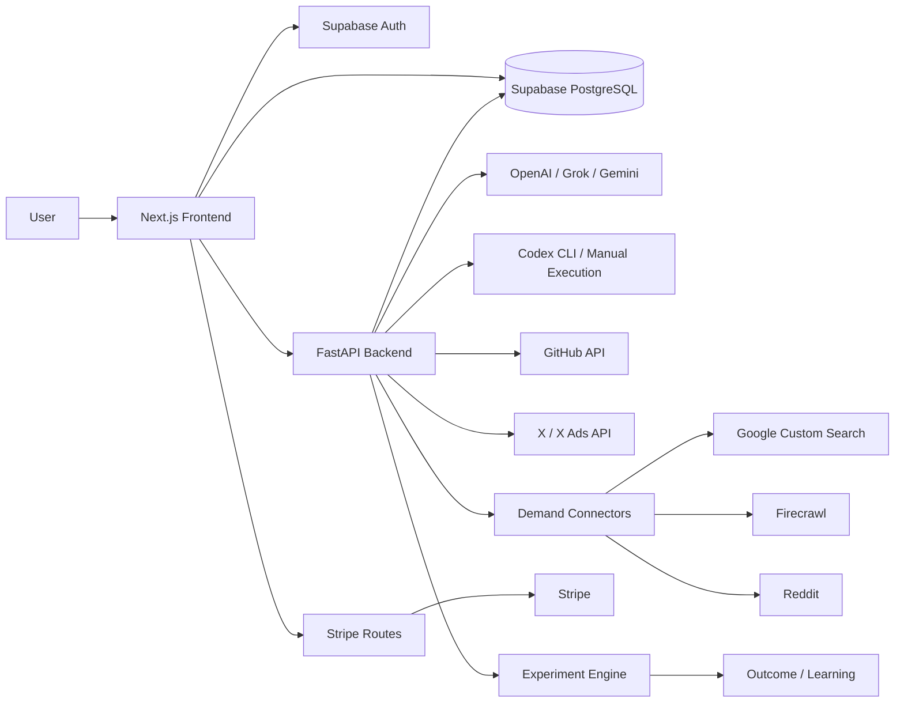
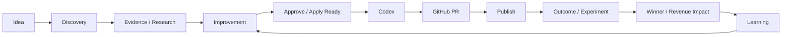

# AdFlow-AI プロダクト概要

最終更新: 2026年6月15日

本書は、Phase1〜Phase8実装後のコード、画面、API、DB migration、自動テスト、実Supabase統合試験を根拠に、AdFlow-AIの現在地を第三者向けに説明する文書です。

# AdFlow-AIとは

AdFlow-AIは、アイデアや市場課題の発見から、需要Evidence収集、広告・LP改善、実装、公開、効果測定、実験、学習までを一つの監査可能なループとして管理するサービスです。

単発のAI提案ではなく、次の情報を関連付けて保存します。

- 何を根拠に需要があると判断したか
- どの改善提案を誰が承認したか
- CodexやGitHubで何を実装したか
- 公開後の指標がどう変わったか
- どのVariantが勝ち、売上影響がどの程度だったか
- 次回提案へどのLearningを利用したか

対象ユーザーは、SaaS・デジタルサービスの広告運用担当者、マーケター、プロダクトチーム、広告代理店、個人開発者です。

# AdFlow-AI全体アーキテクチャ

- Frontend: Next.js 15、React 19、TypeScript、Tailwind CSS、TanStack Query
- Backend: FastAPI、Python、Pydantic
- DB / Auth / Realtime: Supabase PostgreSQL、Supabase Auth、RLS、Realtime
- Billing: Stripe Checkout、Portal、Webhook、Credit台帳
- AI: OpenAI、Grok、Gemini、Codex
- 外部連携: GitHub、X Ads、Google Custom Search、Firecrawl、Reddit

# 現在実装済み機能

## Demand Discovery

チャット形式で市場課題やアイデアを入力し、調査セッションを作成・保存・再開できます。セッション一覧、検索、お気に入り、削除、Project関連付けを実装しています。

## Demand Intelligence / Market Research / Competitor Analysis

実ConnectorからEvidenceを収集し、重複排除、キャッシュ、Connector監査ログ、Competitor候補、Demand Score、Learning Contextを保存します。実データとSynthetic参考値は`data_source_type`で分離します。

## Ad / LP Analysis

広告とLPをPairとして登録し、メッセージ整合性、CTA、オファー、需要Evidence、過去Outcome Learningを使って分析します。AI結果はREAL / MOCKを区別します。

## AI Orchestration / Agent Routing

複数AI Providerの提案・レビュー・Scorecardを管理します。MOCK結果は明示され、Scorecard、Codex、Outcome Learningから除外されます。

## Improvement System

改善提案を`GENERATED → APPROVED → APPLY_READY → APPLIED`、または`REJECTED / FAILED`として管理します。状態、理由、更新者、更新日時、監査履歴をDB保存します。

## GitHub Integration

GitHub OAuth接続、Repository選択、権限確認、専用Branch、Commit、Pull Request作成、PR一覧、状態同期、監査イベントを実装しています。

## Codex Integration

Apply Ready改善案からCodex Taskを作成し、一覧・詳細・状態履歴・実行ログを管理します。REAL_EXECUTIONとMANUAL_EXECUTIONを区別し、結果をGitHub PRまたはOutcomeへ接続します。

## Outcome / Learning

Improvement、Codex Task、GitHub PRからOutcomeを作成できます。Before / After、測定方法、Evidence、改善率、評価状態を保存し、成功・失敗パターンを次回分析へ利用します。

## X Ads Integration / Publish

OAuth・手動接続、検証、アカウント取得、広告・指標同期、公開要求、承認、投稿、promoted tweet関連付け、イベント保存を実装しています。

## Experiment / Measurement

Experiment状態、複数Variant、Traffic allocation、安定したsession割当、LP Runtime Analytics、X Ads指標集計を実装しています。サンプル数とconfidence thresholdを満たした場合のみWinnerを確定します。

## Revenue Impact / Insight / Alert

Winner確定時にExperiment Learning、Revenue Impact、Evidence付きInsight、通知を保存します。関連Outcomeがある場合はOutcome MeasurementとLearningへ接続します。

## Project / Operations

Project CRUD、複製、アーカイブ、復元、Global Search、Notification Center、Background Jobs、Activity Timeline、Saved Views、Workspace Settings、Realtime同期を実装しています。

## Billing / Credit

Stripe Checkout、追加Credit購入、Portal、Webhook冪等処理、支払い失敗、返金、キャンセル、Credit残高・台帳を実装しています。

# コアワークフロー

このループはコード、自動テスト、実Supabase統合試験で接続を確認済みです。外部サービスを利用する処理は、それぞれの認証情報と権限が必要です。

# 現在の完成度評価

| 評価軸 | 評価 | 理由 |
| --- | ---: | --- |
| 技術的完成度 | 92 / 100 | Phase1〜8の主要DB・API・UI・状態遷移・監査ログを実装 |
| ユーザー体験完成度 | 85 / 100 | 継続運用画面と検索・通知・履歴を実装。一部運用UIは改善余地あり |
| 収益化準備度 | 93 / 100 | Stripe test modeで成功・失敗・返金・キャンセル・冪等性を確認 |
| 自動化完成度 | 88 / 100 | DiscoverからLearningまで接続。外部Connector設定と複数instance制御は運用課題 |
| データ品質 | 88 / 100 | REAL / MOCK、REAL / SYNTHETIC、Evidence、測定結果を分離 |
| AI活用度 | 90 / 100 | 複数AI、Codex、Scorecard、Outcome / Experiment Learningを接続 |

# 現在の制限

- Reddit実取得にはAPI審査・認証情報が必要です。
- Google Suggest、Related Search、PAA、YouTubeコメント専用取得は確認できません。
- 外部サービスの本番Rate Limit・障害耐性は環境ごとの運用試験が必要です。
- 複数Backend instanceでのExperiment定期評価には分散ロックが必要です。
- 連続値Experimentの高度な統計評価は実装していません。
- Team / Organization単位の権限管理は確認できません。

# 最終完成形

現在のコードは、AdFlow-AIが目指してきた「根拠付き改善ループ」の主要部分を実装しています。

ユーザーは需要Evidenceを確認し、AI提案を人間の判断で承認し、CodexとGitHubへ実装を渡し、公開後のOutcomeとExperimentを測定できます。勝者、失敗、Revenue ImpactはLearningとして保存され、次の改善提案へ戻ります。

今後の中心課題は新しい機能カテゴリの追加ではなく、外部Connectorの本番運用、統計精度、複数instance対応、Team権限、観測性の成熟です。

# リリース判定

**READY**

Phase1〜Phase8の主要フローについて、コード実装、自動テスト、実Supabase保存・再取得を確認済みです。本番利用には各外部サービスの認証情報設定と、本番アカウントを使ったスモークテストが必要です。

# 主な根拠

- `docs/adflow-ai-current-state.md`
- `docs/unimplemented-features-audit.md`
- `docs/phase1-audit-report.md` 〜 `docs/phase8-audit-report.md`
- `backend/api/main.py`
- `backend/services/**`
- `frontend/app/**`
- `supabase/migrations/**`
