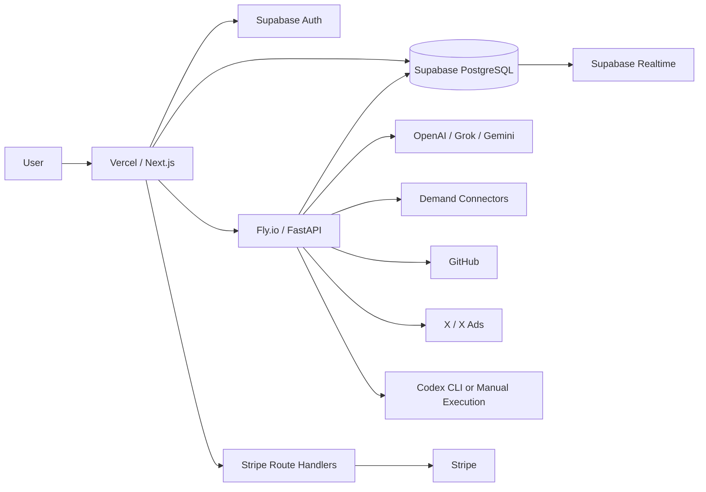

# AdFlow-AI 実装・リリース Source of Truth

最終更新: 2026年6月19日

## この文書の目的

この文書は、別のAIや新しい開発者がAdFlow-AIのコードベースを読み始める際に、次の内容を一度に判断できるようにするための正本です。

- 現在、何がコードとして実装されているか
- DB、API、UI、外部サービスがどこまで接続されているか
- 自動テスト・実DB試験で何を確認済みか
- 現在のProductionへ何がデプロイされているか
- リリースまでに何を、どの順番で完了すべきか
- 実装済み、設定待ち、未確認、未実装をどう区別するか

コードと本書が矛盾する場合は、Frontend、Backend、migration、test、実環境の順に接続を追跡し、コード上の事実を優先してください。

## 状態ラベル

| ラベル | 意味 |
| --- | --- |
| `IMPLEMENTED` | コード、API、保存処理が存在する |
| `VERIFIED` | 自動テストまたは実DB試験で動作を確認した |
| `DEPLOYED` | 現在のProductionへ反映済み |
| `EXTERNAL` | コードはあるが外部審査、認証情報、対象アカウントが必要 |
| `PARTIAL` | 主経路はあるが運用要件や一部機能が不足する |
| `NOT_IMPLEMENTED` | 必要な処理経路が存在しない |
| `BLOCKER` | 対象リリースに進む前に解消が必要 |

## 結論

AdFlow-AIの主要な閉ループはコードとSupabase上で成立しています。

```text
Demand Discovery
  -> Evidence / Competitor Research
  -> Ad-LP Pair Analysis
  -> Improvement
  -> Human Approval
  -> Codex Task / GitHub PR / X Ads Publish
  -> Outcome
  -> Experiment / Measurement
  -> Learning
  -> Next Improvement
```

ただし、2026年6月19日時点の判定は次のとおりです。

| リリース形態 | 判定 | 理由 |
| --- | --- | --- |
| ローカル開発・社内検証 | `READY` | 主要コード、DB、テスト、起動スクリプトが揃っている |
| 限定ベータ | `CONDITIONAL READY` | 最新コードの再デプロイとProduction smoke testが必要 |
| 有料一般公開 | `NOT READY` | StripeがTest Mode、外部連携の本番受入試験、監視・運用手順が未完了 |

「Phase1〜Phase8実装済み」は、全外部サービスが本番運用可能という意味ではありません。内部ワークフローの実装と、外部アカウントを使ったProduction受入試験を分けて判断してください。

## プロダクト定義

AdFlow-AIは、広告とランディングページを同じ改善単位として扱い、需要証拠、AI提案、人間の承認、実装、公開、測定、学習を追跡する広告改善ワークスペースです。

現在の正しいポジショニング:

- Ad Optimization Workspace
- 広告改善ワークスペース
- EvidenceからOutcomeまでを追跡する運用基盤

誤ったポジショニング:

- 成功や売上を予測するサービス
- 自動で必ず成果を出す広告AI
- 人間の承認なしで本番変更するシステム
- Build Decision Platform

## システム構成



| レイヤー | 実装 |
| --- | --- |
| Frontend | Next.js 15 App Router、React 19、TypeScript、Tailwind CSS |
| UI / State | TanStack Query、Zustand、shadcn/ui系コンポーネント、Recharts |
| Backend | FastAPI、Pydantic、Python 3.12 |
| DB / Auth | Supabase PostgreSQL、Supabase Auth、RLS |
| Realtime | Supabase Realtime、10秒ポーリングフォールバック |
| Billing | Stripe Checkout、Billing Portal、Webhook |
| Deployment | Vercel + Fly.io |

## 現在のProduction

| 対象 | 現在値 | 状態 |
| --- | --- | --- |
| Frontend | `https://adflow-ai-wine.vercel.app` | `DEPLOYED`, HTTP 200 |
| Backend | `https://adflow-ai-api.fly.dev` | `DEPLOYED`, `/ready` HTTP 200 |
| Backend構成 | Fly.io nrt、1 machine | Experiment定期処理の重複を避けるため1台 |
| DB | Supabase | migration `202606190001` 適用・実証済み |
| Stripe | Test Mode | `BLOCKER` for paid public release |

重要:

- 最新のFeature Gating Backend / Frontendコードは、まだFly.io / Vercelへ再デプロイしていません。
- DB Triggerは適用済みのためProduction DBでは制限されますが、旧APIでは構造化403ではなくDB由来エラーになる場合があります。
- 現在のデプロイはdirty worktreeから行われ、Git commitとProduction artifactの対応が固定されていません。

## 主要機能マトリクス

### 認証・Project・Operations

| 機能 | 状態 | 根拠・注意 |
| --- | --- | --- |
| Supabase Auth | `VERIFIED` | Bearer token検証、認証後ルート保護 |
| Project CRUD | `VERIFIED` | 作成、編集、複製、停止、アーカイブ、復元、論理削除 |
| Global Search | `VERIFIED` | Project、Discovery、Research、Competitor、Improvement、Codex、Outcome、Learning |
| Notification Center | `VERIFIED` | 既読、未読、削除、Realtime |
| Background Jobs | `VERIFIED` | 状態表示、失敗理由、対応Jobの再実行 |
| Activity Timeline | `VERIFIED` | DB Triggerによる横断イベント保存 |
| Saved Views | `VERIFIED` | ユーザー単位保存 |
| Workspace Settings | `VERIFIED` | locale、timezone、表示密度、通知設定 |
| Team / Organization | `NOT_IMPLEMENTED` | 現在はユーザー単位RLS |

### Demand Discovery / Intelligence

| 機能 | 状態 | 根拠・注意 |
| --- | --- | --- |
| Discovery Session | `VERIFIED` | 作成、履歴、再開、検索、お気に入り、削除 |
| Demand Intelligence Run | `VERIFIED` | Signal、Cluster、Validation、Fit、Monitoring |
| Evidence保存 | `VERIFIED` | URL、引用、Connector、関連分析を保存 |
| Competitor保存 | `VERIFIED` | 候補、domain、category、比較情報 |
| Demand Score | `VERIFIED` | 構成要素、重み、理由、Evidence件数 |
| Learning Context | `VERIFIED` | market、quality、density、trend、score |
| REAL / SYNTHETIC識別 | `VERIFIED` | `data_source_type` とUI表示 |
| Google Custom Search | `EXTERNAL` | API keyとSearch Engine IDが必要 |
| Firecrawl | `EXTERNAL` | API keyが必要 |
| Reddit | `EXTERNAL` | API審査とClient ID / Secretが必要 |
| X Search | `EXTERNAL` | Bearer tokenとAPI権限が必要 |
| Review Connector | `PARTIAL` | 検索由来取得はあるが各レビューサイト専用正式APIではない |
| Google Suggest / PAA | `NOT_IMPLEMENTED` | 専用取得経路なし |
| YouTube Comments | `NOT_IMPLEMENTED` | 専用Connectorなし |

Productionでは`DEMAND_SYNTHETIC_FALLBACK=false`を必須にしています。データ0件の場合にSynthetic結果を実測値として返してはいけません。

### 広告・LP・Pair

| 機能 | 状態 | 根拠・注意 |
| --- | --- | --- |
| 広告CRUD | `VERIFIED` | 手動登録、CSV、X Ads同期 |
| LP CRUD | `VERIFIED` | 手動登録、URL取込、version履歴 |
| Pair CRUD | `VERIFIED` | 広告とLPを分析単位として保存 |
| Pair Analysis | `VERIFIED` | AI分析、履歴、Improvement生成 |
| LP Runtime Analytics | `VERIFIED` | Event保存とExperiment集計 |
| 実ブラウザ監査 | `PARTIAL` | Core Web Vitals・レンダリング監査基盤は限定的 |

### AI Orchestration / Improvement

| 機能 | 状態 | 根拠・注意 |
| --- | --- | --- |
| OpenAI Provider | `VERIFIED` | Production readinessで必須 |
| Grok / Gemini Provider | `IMPLEMENTED`, `EXTERNAL` | 認証情報と本番受入試験が必要 |
| Mock Provider | `IMPLEMENTED` | 開発用途。Production default禁止 |
| REAL / MOCK識別 | `VERIFIED` | `provider_type`, `source_provider`, `failure_reason` |
| MOCK Learning除外 | `VERIFIED` | Scorecard、Codex、Outcome Learningから除外 |
| Improvement一覧・詳細 | `VERIFIED` | 検索、状態、統計 |
| Approve / Reject | `VERIFIED` | DB保存、理由、更新者、監査履歴 |
| Apply Ready / Applied / Failed | `VERIFIED` | BackendとDBで不正遷移を拒否 |

Improvement状態:

```text
GENERATED -> APPROVED -> APPLY_READY -> APPLIED
GENERATED -> REJECTED
APPROVED -> REJECTED
APPLY_READY -> FAILED
FAILED -> APPLY_READY
```

### Codex

| 機能 | 状態 | 根拠・注意 |
| --- | --- | --- |
| Task作成・保存 | `VERIFIED` | Apply ReadyかつREAL Improvementから作成 |
| 一覧・詳細 | `VERIFIED` | Filter、Pagination、履歴、実行ログ |
| MANUAL_EXECUTION | `VERIFIED` | 結果を構造化保存 |
| REAL_EXECUTION | `IMPLEMENTED`, `EXTERNAL` | Codex CLI、git workspace、実行権限が必要 |
| MOCK Execution | `DISABLED` | 本番デフォルト禁止 |
| PR / Outcome接続 | `VERIFIED` | 結果差分から下流へ接続 |

現在のBackend Docker imageにはCodex CLIをインストールする処理がありません。Fly.ioで`REAL_EXECUTION`を提供するには、Docker imageへのCodex CLI導入、workspace、git credentials、sandbox方針が必要です。それまではMANUAL_EXECUTIONが実運用経路です。

### GitHub

| 機能 | 状態 | 根拠・注意 |
| --- | --- | --- |
| OAuth / Token接続 | `IMPLEMENTED` | user単位暗号化保存 |
| Repository / Branch取得 | `IMPLEMENTED` | 権限確認、missing判定 |
| Branch作成 | `VERIFIED` | `adflow/{improvement_id}` |
| Commit / PR作成 | `VERIFIED` | SHA、URL、番号、監査イベント保存 |
| PR状態同期 | `VERIFIED` | 手動・定期同期 |
| Production real GitHub | `CONFIGURATION REQUIRED` | `ADFLOW_GITHUB_PROVIDER=github`と実認証情報を確認する |

`backend/fly.toml`の既定値は`ADFLOW_GITHUB_PROVIDER=memory`です。一般公開前にProductionで実GitHubを提供するか、該当UIを非表示にするかを決定してください。

### X Ads

| 機能 | 状態 | 根拠・注意 |
| --- | --- | --- |
| OAuth / Manual接続 | `IMPLEMENTED` | token暗号化保存 |
| Account・広告・指標同期 | `VERIFIED` | 保存・再取得経路あり |
| Publish Request | `VERIFIED` | Draft、承認、Reject |
| Human Approval付き公開 | `VERIFIED` | 公開イベントと失敗保存 |
| 外部Revoke | `PARTIAL` | DB状態変更と外部失効の実アカウント確認が必要 |
| Production X Ads | `EXTERNAL` | Developer権限、広告アカウント、Rate Limit試験が必要 |

### Outcome / Learning

| 機能 | 状態 | 根拠・注意 |
| --- | --- | --- |
| Outcome作成 | `VERIFIED` | Improvement、Codex、GitHubから作成 |
| Before / After測定 | `VERIFIED` | 指標、期間、方法、Evidence |
| 自動評価 | `VERIFIED` | SUCCESS、PARTIAL、NO_IMPACT、FAILED |
| Learning保存 | `VERIFIED` | quality、confidence、改善率、分類 |
| 次回分析利用 | `VERIFIED` | Outcome / Experiment Learningを参照 |
| Connector更新 | `PARTIAL` | X Adsは接続。将来Connector追加可能 |

### Experiment / Measurement

| 機能 | 状態 | 根拠・注意 |
| --- | --- | --- |
| Experiment CRUD | `VERIFIED` | 状態遷移・監査履歴 |
| Variant A/B/C | `VERIFIED` | 複数Variant、allocation |
| Traffic Assignment | `VERIFIED` | session hashによる安定割当 |
| LP Event | `VERIFIED` | public eventのvariant改ざん・売上偽装を拒否 |
| Measurement | `VERIFIED` | LP / X Ads集計 |
| Winner Detection | `VERIFIED` | sample、confidence、Evidence |
| Learning / Insight | `VERIFIED` | 勝者検出時のみ保存 |
| Revenue Impact | `VERIFIED` | 保存値から推定差分を算出 |
| 連続値の高度統計 | `PARTIAL` | 二値指標中心。高度な分散推定なし |
| 複数Backend instance | `PARTIAL` | 分散ロック未実装。現在はFly 1 machine |
| Tracking token rotation | `NOT_IMPLEMENTED` | 失効・再発行UIなし |

### Billing / Credits / Feature Gate

現在の料金:

| Plan | JPY | USD | 月間Credit |
| --- | ---: | ---: | ---: |
| Free | 0円 | $0 | 500 |
| Starter | 2,980円 | $24 | 2,500 |
| Growth | 6,980円 | $55 | 8,000 |
| Business | 個別 | 個別 | 個別 |

追加Credit:

| Credit | JPY | USD |
| ---: | ---: | ---: |
| 1,000 | 1,980円 | $16 |
| 5,000 | 7,900円 | $63 |
| 20,000 | 25,800円 | $205 |

Feature Gate:

| 機能 | Free | Starter | Growth | Business |
| --- | --- | --- | --- | --- |
| 保存アイテム | 合計10件 | 無制限 | 無制限 | 個別 |
| Pair Analysis | 不可 | 可 | 可 | 可 |
| Experiment作成 | 不可 | 不可 | 可 | 可 |

Free保存アイテムの対象:

- Project
- 広告
- LP
- Ad-LP Pair
- Demand Discovery Session

Feature GateはFastAPIとDB Triggerの両方で強制します。直接Supabase RESTへ書き込んでも回避できません。

実DBで確認した行列:

| Plan | 11件目保存 | Pair Analysis | Experiment |
| --- | --- | --- | --- |
| Free | 拒否 | 拒否 | 拒否 |
| Starter | 許可 | 許可 | 拒否 |
| Growth | 許可 | 許可 | 許可 |

Credit消費:

| 操作 | Credit |
| --- | ---: |
| Demand Intelligence | 50 |
| Pair Analysis | 80 |
| Solution Fit | 120 |
| Full Workflow | 300 |
| Outcome Learning rebuild | 20 |
| Codex Task | 100 |
| Codex Execution | 150 |
| GitHub PR | 40 |
| Outcome Draft | 20 |
| X Ads Sync | 20 |
| X Ads Publish | 40 |

Billing実装:

- Checkout Session作成
- Checkout完了状態検証
- Billing Portal
- Webhook署名検証
- Webhook冪等処理
- Subscription更新・キャンセル
- Payment failure
- Credit purchase
- Refund時のCredit減算
- Credit消費・補償・idempotency

現在はStripe Test Modeです。Live key、Live Price、Live Portal Configuration、Live Webhookを用意するまで実課金リリースは不可です。

### Public LP / Contact

| 機能 | 状態 | 根拠・注意 |
| --- | --- | --- |
| 日英切替 | `IMPLEMENTED` | LP主要コピーは専用i18n |
| 現行ポジショニング | `VERIFIED` | 広告改善ワークスペース |
| 問い合わせ | `VERIFIED` | validation、honeypot、rate limit、DB保存 |
| Weekly LP Snapshot | `IMPLEMENTED` | DB snapshotと公開Route |
| 自動週次Cron | `PARTIAL` | 現在Vercel cron設定を外しているため外部Schedulerが必要 |
| アプリ全体i18n | `BLOCKER` if full bilingual is promised | auditでvisible hard-coded string 114件 |

## APIと保存境界

FastAPIの主要Endpoint群:

- `/operations/**`
- `/ad-optimization/**`
- `/experiments/**`
- `/demand-discovery/**`
- `/demand-intelligence/**`
- `/analysis/pairs/**`
- `/improvements/**`
- `/orchestration/**`
- `/codex-tasks/**`
- `/integrations/github/**`
- `/integrations/x-ads/**`
- `/outcomes/**`
- `/billing/**`
- `/credits/**`

一部CRUDはFrontendからSupabaseへ直接アクセスします。そのため、重要な制約はAPIだけでなくRLS、constraint、triggerでも保護する必要があります。

必ずDBでも保護するもの:

- user ownership
- 状態遷移
- Free保存上限
- Pair Analysis plan
- Experiment creation plan
- Webhook / Credit idempotency
- REAL / MOCK / SYNTHETICの許容値

## セキュリティ・信頼性

実装済み:

- Supabase AuthとRLS
- Backendでのuser_id絞り込み
- Stripe Webhook署名
- Webhook event冪等性
- Credit消費idempotency
- GitHub / X token暗号化用key
- URL取込のpublic URL安全確認
- Public Experiment Eventのvariant割当検証
- Public EventからConversion / Revenueを直接登録する経路の拒否
- ProductionでMock AI、memory storage、Synthetic fallbackを拒否するreadiness
- `/ready`によるSupabase接続確認

残課題:

- Team / Organization authorization
- Production外部APIのRate Limit・長時間障害試験
- LP tracking token rotation
- 複数instance job locking
- Secret rotation手順
- Backup / restore訓練
- Sentry等の集中エラー監視

## テスト・検証状況

2026年6月19日時点:

| 検証 | 結果 |
| --- | --- |
| Backend全テスト | `101 passed` |
| Feature Gate + Experiment対象テスト | `17 passed` |
| Frontend typecheck | 成功 |
| Frontend production build | 成功 |
| `git diff --check` | 成功 |
| npm audit | 0 vulnerabilities確認済み |
| Feature Gate実DB/API | Free / Starter / Growth行列を確認 |
| 一時試験データ | 削除済み |
| Production Frontend | HTTP 200 |
| Production Backend `/ready` | HTTP 200 |
| i18n audit | 失敗、hard-coded visible strings 114件 |

E2E:

- LP positioning test: 成功
- Authenticated Outcome API/UI test: 成功
- Feature Gate upgrade action test: 成功
- 未認証redirect test: 単独再実行成功
- 全E2E並列実行ではNext.js初回compile中にredirect testが1回timeoutしたため、CI安定性改善余地あり

## 実装されていないもの

- Team / Organization / Role権限
- Google Suggest、Related Search、PAA専用取得
- YouTubeコメント専用Connector
- LP tracking token失効・再発行UI
- 複数Backend instance向け分散Job lock
- 高度な連続値Experiment統計
- Production Docker内Codex CLI
- 完全なアプリ全体日英翻訳
- Vercel内の週次LP snapshot Cron

## リリースまでの逆算

### P0: 最新コードをProductionへ一致させる

1. dirty worktreeの変更範囲をレビューする。
2. Feature Gateを含むリリース対象をcommitする。
3. commit SHAを記録する。
4. Fly.ioを再デプロイする。
5. Vercelを再デプロイする。
6. `/ready`、ログ、Production aliasを確認する。
7. Free / Starter / GrowthのProduction smoke testを実行する。

完了条件:

- DB、Fly、Vercelが同じリリース内容を参照する
- APIが`PLAN_UPGRADE_REQUIRED` / `PLAN_LIMIT_REACHED`を構造化403で返す
- UIにUpgrade導線が表示される

### P0: 課金リリース方式を決定する

選択肢A: 無料限定ベータ

- Checkoutを非表示またはTest Modeであることを明示
- 有料契約を受け付けない

選択肢B: 有料一般公開

- Stripe Live Secret Key
- JPY / USDのLive Price ID
- Live Billing Portal Configuration
- Live Webhook endpointと署名secret
- 成功、失敗、返金、キャンセルのLiveまたはStripe推奨手順による受入試験
- 特商法、利用規約、返金方針、サポート窓口の最終確認

### P0: LPが約束する外部機能を実際に提供する

GitHub / Codex / X AdsをLPで強く訴求する場合:

- GitHub production providerとOAuth callbackを確認
- 実RepositoryでBranch、Commit、PRを作成
- CodexはMANUAL_EXECUTIONのみ提供するか、DockerへCLIを導入するか決定
- X Ads実広告アカウントでsync、approval、publishを確認
- 利用できない連携はUI上でUnavailableとして明示する

### P1: 運用監視

- 集中エラー監視
- Uptime監視
- Stripe webhook failed event監視
- Connector failure / Rate Limit監視
- Background Job失敗通知
- Supabase backup / restore手順
- Secret rotation手順
- Incident response連絡先

### P1: UI品質

- `npm run i18n:audit`の114件を解消、または日本語のみ提供範囲を明示
- E2Eの初回compile timeoutを安定化
- Mobile、Safari、Chromeの主要フロー確認
- Empty / Loading / Error / Plan blocked状態の画面確認
- Accessibilityとkeyboard navigation確認

### P2: 運用成熟

- Team / Organization
- Distributed Job Lock
- Tracking token rotation
- 高度なExperiment統計
- Core Web Vitals監査
- Connector追加と長期障害試験

## リリース受入チェックリスト

### Build

- [ ] Backend全pytest成功
- [ ] Frontend typecheck成功
- [ ] Frontend production build成功
- [ ] E2E成功
- [ ] npm audit確認
- [ ] i18n提供範囲の確認

### Database

- [x] migration `202606190001`適用
- [x] RLS確認
- [x] Feature Gate直接DB回避防止
- [ ] Production migration一覧とrepositoryの一致確認
- [ ] Backup / restore確認

### Billing

- [ ] 無料ベータか有料公開か決定
- [ ] Live Modeへ移行する場合はLive Stripe構成
- [ ] Webhook成功・失敗監視
- [ ] 返金とCredit整合性の運用手順

### External Services

- [ ] OpenAI Production quota確認
- [ ] GitHub実Repository受入試験
- [ ] X Ads実Account受入試験
- [ ] Google / Firecrawl quota確認
- [ ] Reddit審査完了後の受入試験
- [ ] Codex提供モード決定

### Deployment

- [ ] release commit作成
- [ ] Fly deploy
- [ ] Vercel deploy
- [ ] Production smoke test
- [ ] rollback手順確認
- [ ] release SHA記録

### Operations

- [ ] Error monitoring
- [ ] Uptime monitoring
- [ ] Support contact
- [ ] Privacy / Terms / Tokusho最終レビュー
- [ ] Data deletion request手順
- [ ] Incident response手順

## 別のAIが作業を始める順序

1. 本書を読む。
2. `CLAUDE.md`を読む。
3. `git status --short`で未コミット変更を確認する。
4. 対象画面を`frontend/app`で探す。
5. hook、API client、FastAPI endpoint、service、repository、migration、testを順に追う。
6. UIだけで完成と判断しない。
7. 外部サービスはコード存在とProduction利用可能を分ける。
8. 修正後は保存、再取得、再読込、不正操作、直接API、直接DBを確認する。

## 根拠ファイル

優先度順:

1. `backend/api/main.py`
2. `backend/services/**`
3. `frontend/app/**`
4. `frontend/hooks/**`
5. `frontend/lib/api/**`
6. `frontend/lib/billing/plans.ts`
7. `supabase/migrations/**`
8. `backend/tests/**`
9. `frontend/e2e/**`
10. `docs/phase1-audit-report.md`から`docs/phase8-audit-report.md`

重要な最新ファイル:

- `backend/services/billing/entitlements.py`
- `backend/services/billing/credits.py`
- `frontend/lib/api/errors.ts`
- `supabase/migrations/202606190001_plan_feature_gating.sql`
- `backend/tests/test_plan_feature_gating.py`
- `frontend/e2e/plan-feature-gating.spec.ts`

## 文書の更新ルール

次の変更を行った場合、本書も更新してください。

- Plan、価格、Credit、Feature Gate
- 新しいmigration
- Production URLまたはprovider設定
- 外部サービスの本番受入完了
- テスト件数
- リリース判定
- LPで訴求する機能

Phase監査レポートは履歴であり、過去の「READY」を現在のProduction readinessとして流用しないでください。
