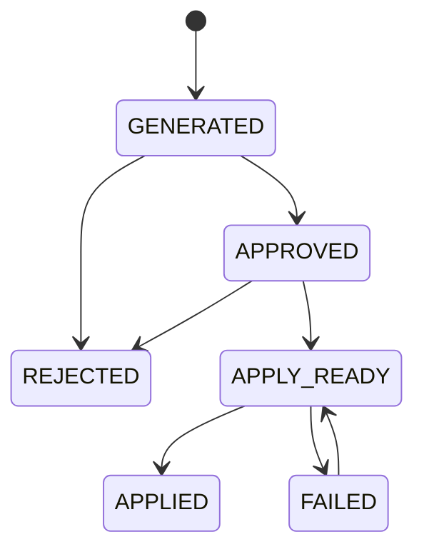

# Phase2 Audit Report

> **時点監査資料:** この文書の「現状問題一覧」は当該Phase開始時点の記録です。現在の状態は [`adflow-ai-current-state.md`](adflow-ai-current-state.md) と [`phase8-audit-report.md`](phase8-audit-report.md) を参照してください。

実施日: 2026-06-12

対象: Improvement Workflowの生成、承認、却下、Apply Ready、適用、失敗、一覧、監査ログ、統計

## 現状問題一覧

| 発見した問題 | 影響 | 修正内容 |
| --- | --- | --- |
| 改善一覧が`analysis_runs`から仮IDを生成していた | 改善提案単位の状態を保存・再取得できない | `ai_agent_results`を改善提案の正式レコードとして使用 |
| Approveが固定レスポンスだった | UI上は成功してもDB状態が変わらない | 専用遷移APIとDB更新へ接続 |
| Rejectがトースト表示だけだった | 却下状態と理由が残らない | 理由必須のReject遷移を実装 |
| 状態名が`pending`、`accepted`、`needs_review`等で分散していた | 画面・API・外部公開処理で意味が一致しない | 6状態へ統一し、既存状態をmigrationで変換 |
| 任意状態へ直接更新できた | 不正な状態遷移が可能 | サービス層とDBトリガーの両方で遷移を制限 |
| 状態変更専用の監査ログがなかった | 誰がいつ何を判断したか追跡しにくい | `improvement_status_history`と自動記録トリガーを追加 |
| Apply ReadyにGitHub連携準備情報がなかった | Phase3の実装処理へ渡す構造が不足 | `apply_ready_metadata`へ提案・プロジェクト・ペア・実行IDを保存 |
| 一覧に全状態フィルタ、検索、並び替え、件数がなかった | 提案数が増えた際に管理できない | 一覧UIをDB由来の状態で更新 |
| ダッシュボードに改善統計がなかった | Workflowの進捗を把握できない | DB集計RPCと統計カードを追加 |

## 状態遷移設計

遷移ルール:

- `GENERATED`は生成直後の状態。
- `APPROVED`は人間が提案を承認した状態。
- `REJECTED`には理由が必須で、終端状態。
- `APPLY_READY`はGitHub・Codex・X Ads等の実行処理へ渡せる状態。
- `APPLIED`は適用完了の終端状態。
- `FAILED`は適用処理失敗状態。修正後に`APPLY_READY`へ戻せる。
- 許可されていない遷移はサービス層とDBトリガーの両方で拒否する。

## 実装変更一覧

| ファイル | 変更内容 |
| --- | --- |
| `supabase/migrations/202606120002_phase2_improvement_workflow.sql` | 状態統一、更新者・更新日時・Apply Ready情報、監査ログ、DB遷移制約、統計RPC |
| `backend/services/improvements/improvement_workflow_service.py` | 一覧、詳細、検索、並び替え、統計、状態遷移、監査ログ取得 |
| `backend/api/main.py` | Improvement専用API |
| `backend/services/orchestration/ai_orchestrator.py` | 生成状態と判断処理を統一Workflowへ接続 |
| `backend/services/x_ads/x_ads_service.py` | X Ads公開成功時にAPPLIED、失敗時にFAILEDへ遷移 |
| `backend/services/outcomes/improvement_outcome_service.py` | APPLY_READY状態名へ統一 |
| `frontend/lib/api/improvements.ts` | 固定レスポンスを除去し、認証付きAPIへ接続 |
| `frontend/hooks/useImprovement.ts` | 一覧・詳細・履歴・統計・遷移後の再取得 |
| `frontend/components/improvements/**` | 状態操作、Reject理由、監査ログ、フィルタ、検索、並び替え、件数 |
| `frontend/app/dashboard/page.tsx` | 総提案数、承認率、却下率、Apply Ready、適用済、失敗数 |
| `backend/tests/test_phase2_improvement_workflow.py` | 状態遷移、理由、不正遷移、監査、検索、統計テスト |

## 動作確認結果

| 確認項目 | 結果 |
| --- | --- |
| Approve | サービス層テストPASS。DB更新用API接続済み |
| Reject | 理由必須・終端状態テストPASS |
| Apply Ready | APPROVEDからのみ遷移し、準備メタデータを保存するテストPASS |
| Applied / Failed | APPLY_READYからのみ遷移可能。X Ads公開処理にも接続 |
| 不正遷移 | サービス層テストPASS。DBトリガーもmigrationに実装 |
| 一覧更新 | 全6状態フィルタ、件数、検索、並び替えを実装 |
| 監査ログ | DBトリガーと詳細画面表示を実装 |
| 統計情報 | DB集計RPCとダッシュボード表示を実装 |
| バックエンドテスト | 43件PASS |
| TypeScript型検査 | PASS |
| 本番ビルド | PASS |
| 固定レスポンス・旧状態名の残存grep | 実行コード上で該当なし |

## DB確認結果

Phase2 migration適用後、接続中Supabase実DBに一時ユーザーと2件の改善提案を作成し、状態遷移、再取得、監査ログ、統計、不正遷移拒否を検証しました。検証後、一時ユーザーを削除し、関連データもcascade削除しています。

| 確認項目 | 実DB結果 |
| --- | --- |
| Phase2列・監査ログテーブル・統計RPC | PASS |
| 改善提案生成時の`GENERATED`保存 | PASS。2件 |
| `GENERATED → APPROVED → APPLY_READY` | PASS |
| `GENERATED → REJECTED`と理由保存 | PASS |
| DB再取得後の状態維持 | PASS。`APPLY_READY`、`REJECTED` |
| 監査ログ | PASS。生成2件、Approve、Apply Ready、Rejectの計5件 |
| `changed_by`・`changed_at`・理由 | PASS |
| 統計RPC | PASS。総数2、Apply Ready 1、Rejected 1、承認率50%、却下率50% |
| 不正な`REJECTED → APPLIED` | PASS。DBトリガーが拒否 |
| 理由なしReject | PASS。DBトリガーが拒否 |
| テストデータ削除 | PASS。テストユーザー削除により関連データをcascade削除 |

## 未解決事項

Phase2の完了条件に対する未解決事項はありません。

`APPLIED`と`FAILED`はDB遷移制御と自動テストで確認済みです。実外部公開による`APPLIED`・`FAILED`遷移は、X Ads等の実行処理を扱うPhase3以降の外部結合確認対象です。

## Phase3へ進めるか判定

**YES**

Approve、Reject、Apply Readyの実DB保存、理由・更新者・更新日時・監査ログ、再取得後の状態維持、統計RPC、不正遷移防止を接続中Supabaseで確認しました。固定レスポンスやUIだけの状態変更は残っておらず、Phase3が利用する`APPLY_READY`状態とメタデータも永続化されています。
