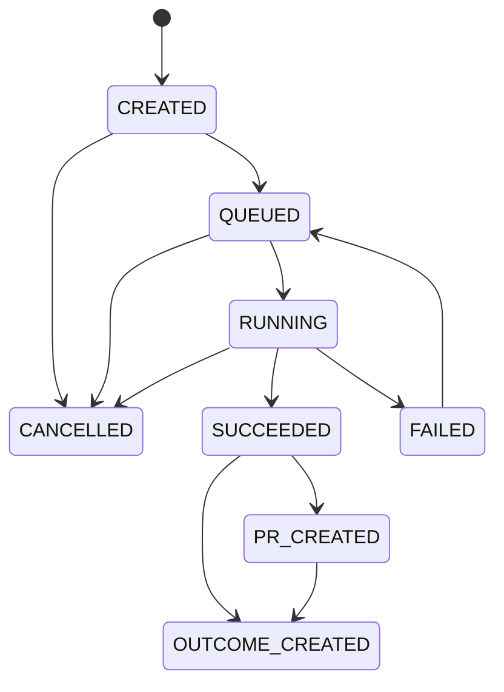

# Phase4 Audit Report

実施日: 2026-06-13

## 現状問題一覧

| 発見した問題 | 影響 | 修正内容 |
| --- | --- | --- |
| Codex Taskは文面保存だけだった | 実行・結果・PR・Outcomeへ進めない | Codex Task実行サービスとAPIを実装 |
| Codex Providerが`MockProvider`だった | Codex実行に見えるMock結果が生成される | Mock経路を削除し、実行パイプライン利用を強制 |
| Task一覧・詳細・履歴APIがなかった | 保存後の再表示・管理ができない | 一覧、詳細、検索、絞り込み、ページネーションAPIを実装 |
| 正式な状態モデルがなかった | 不正遷移・二重実行を防げない | DB制約、trigger、サービス遷移検証を実装 |
| 実行ログと変更ファイルが保存されなかった | 実行内容を監査・PR化できない | Executionテーブルとログ保存を実装 |
| Codex結果とPhase3 PRが接続されていなかった | 実装結果をレビューへ渡せない | Executionの変更ファイルをPhase3 GitHub経路へ接続 |
| Outcomeが実行結果・PR情報を持たなかった | 測定対象と実装内容が追跡できない | 実行概要、期待指標、関連PR、測定予定日を保存 |
| Codex生成課金が非冪等だった | 二重課金や失敗後の消費が起き得る | 冪等消費・補償RPCと処理別キーを実装 |
| 実行中キャンセルがなかった | 外部実行を停止・記録できない | Process終了、CANCELLED保存、クレジット補償を実装 |

## Codex Task状態設計

### 状態一覧

- `CREATED`
- `QUEUED`
- `RUNNING`
- `SUCCEEDED`
- `FAILED`
- `CANCELLED`
- `PR_CREATED`
- `OUTCOME_CREATED`

### 状態遷移図

DB triggerとBackendサービスの両方で、上図にない遷移を拒否します。`MOCK` executionは拒否します。

## 実装変更一覧

### DB migration

- `supabase/migrations/202606130001_phase4_codex_execution_workflow.sql`
  - `codex_task_prompts`状態・結果・PR・Outcome項目追加
  - `codex_task_executions`
  - `codex_task_status_history`
  - GitHub PRとCodex Task/Executionの関連
  - Outcomeの期待指標・測定予定日・実装概要
  - 冪等クレジット消費・補償RPC

### Backend services / API

- `backend/services/codex/codex_task_service.py`
- `backend/services/ai/providers/codex_execution_provider.py`
- `backend/services/ai/provider_registry.py`
- `backend/services/github/github_integration_service.py`
- `backend/services/github/github_api_client.py`
- `backend/services/outcomes/improvement_outcome_service.py`
- `backend/services/billing/credits.py`
- `backend/api/main.py`
- `backend/core/config.py`

### Frontend

- `frontend/app/codex-tasks/page.tsx`
- `frontend/app/codex-tasks/[taskId]/page.tsx`
- `frontend/hooks/use-codex-tasks.ts`
- `frontend/lib/api/codex.ts`
- `frontend/lib/types/adflow.ts`
- Sidebar、Header、改善提案からの遷移

## 動作確認結果

| 項目 | 結果 |
| --- | --- |
| Task作成 | 実DB PASS。Apply Ready・REAL結果のみ許可 |
| 一覧取得・検索・絞り込み・ページネーション | 実DB・Bearer API PASS |
| 詳細取得 | 関連Improvement、Project、Ad、LP、Pair、履歴、Execution、PR、Outcomeを返却 |
| 状態更新・不正遷移 | 実DB PASS。DB triggerが`CANCELLED → SUCCEEDED`を拒否 |
| MANUAL_EXECUTION | 実DB PASS。結果・ファイル・ログを保存 |
| REAL_EXECUTION | 実Codex CLI・実DBでPASS |
| 再実行 | 実DBで`FAILED → QUEUED → RUNNING → SUCCEEDED`を確認 |
| キャンセル | 実DBで`CREATED → CANCELLED`を確認 |
| Mock禁止 | Codex ProviderとExecutionの双方でPASS |
| GitHub PR接続 | 実RepositoryへBranch・Commit・PRを作成 |
| Outcome接続 | `PENDING_MEASUREMENT`ドラフトを実DB保存 |
| 二重実行・二重課金防止 | 実DBで同一idempotency keyが同じexecutionを返すことを確認 |
| PR/Outcome/Execution失敗補償 | 単体テストPASS |
| Codex未設定 | Configuration API・UIで明示、REAL実行を拒否 |
| Backendテスト | 61件PASS |
| クレジット不足 | 実DBで残高0時の拒否とexecution未作成を確認 |
| 失敗時返却 | 実DBで150 creditsの返却と再実行後の再消費を確認 |
| Backend import | PASS |
| Frontend型チェック | 本番ビルド内でPASS |
| Frontend本番ビルド | PASS |
| `git diff --check` | PASS |

## 実行証跡

実Codex CLIを隔離worktreeで実行し、実行結果を接続中Supabaseへ保存しました。

| 項目 | 実証値 |
| --- | --- |
| execution_mode | `REAL_EXECUTION` |
| status | `SUCCEEDED` |
| Codex CLI | `codex-cli 0.137.0-alpha.4` |
| task_id | `da879c89-1794-4aeb-8ca1-6b9cb49af47c` |
| execution_id | `9fc747de-15f5-4ae5-9e86-7e1adce46967` |
| files_changed | `docs/phase4-real-db-proof.txt` |
| 内容 | `Phase4 real DB Codex execution verified.` |
| Mock利用 | なし |

初回実行では、Windows既定CP932でCodex CLIのUTF-8出力を読み取ったためデコードエラーとなり、`FAILED`が保存されました。subprocess入出力をUTF-8固定へ修正し、同じTaskを再実行して成功を確認しました。初回失敗分の150 creditsは実DBで返却されています。

GitHub PR / Outcome実証:

| 項目 | 実証値 |
| --- | --- |
| Repository | `uthuyomi/adflow-ai` |
| Branch | `adflow/codex/e6b7ae1c-095c-4a98-af54-b33076d61fe3` |
| Commit SHA | `b48cfb085247502a58bdeaaf9bd4c58519ebe5e5` |
| PR URL | https://github.com/uthuyomi/adflow-ai/pull/4 |
| PR番号 | `4` |
| 検証後状態 | `CLOSED` |
| Outcome ID | `946a087a-a658-4c03-9aaf-6ae698307923` |
| Outcome状態 | `PENDING_MEASUREMENT` |

## DB確認結果

接続中SupabaseへPhase4 migrationが適用済みであることを確認しました。

検証ユーザー `73f58fc1-f547-4c98-8ca6-5b77d8d5c688` の最終件数:

| 対象 | 件数・状態 |
| --- | --- |
| `codex_task_prompts` | 4件。`OUTCOME_CREATED` 1、`SUCCEEDED` 2、`CANCELLED` 1 |
| `codex_task_executions` | 5件。`SUCCEEDED` 3、`FAILED` 2 |
| `codex_task_status_history` | 22件 |
| `github_pull_requests` | 1件、`CLOSED` |
| `improvement_outcomes` | 1件、`PENDING_MEASUREMENT` |
| `credit_transactions` | 14件。Task・Execution・PR・Outcome消費と失敗返却を保存 |

主要フロー証跡:

- task_id: `e6b7ae1c-095c-4a98-af54-b33076d61fe3`
- execution_id: `f8e0da8e-2fa6-44c4-bf85-744fb5bf2421`
- execution_mode: `MANUAL_EXECUTION`
- 最終Task状態: `OUTCOME_CREATED`
- Bearer API一覧・詳細取得: HTTP 200
- 同一execution idempotency key: 同じexecution IDを返却

異常系証跡:

- 失敗Task `81136931-415e-4ac3-a4cc-9acd89558a0d` は失敗時に150 creditsを返却し、再実行後`SUCCEEDED`
- キャンセルTask `4c710a17-d4a1-4c80-9a7c-0b21d23d1d0b` は`CANCELLED`を維持
- DB triggerは`CANCELLED → SUCCEEDED`を拒否
- 残高0のユーザーは必要150 credits・現在0として実行拒否され、execution件数0を維持

## 未解決事項

1. 本番で`REAL_EXECUTION`を利用するBackend環境には、Codex CLI、git checkout、`CODEX_WORKSPACE`、Codex認証が必要です。未設定環境では正式な`MANUAL_EXECUTION`を利用します。
2. 実行中キャンセルのプロセス管理はBackendプロセス内メモリです。複数worker・複数instance構成では、共有ジョブキューまたは実行基盤によるキャンセル管理が必要です。
3. UIは本番ビルド、API接続、再取得を確認しましたが、ブラウザE2E自動テストは未導入です。

## Phase5へ進めるか判定

**YES**

Apply Ready改善からCodex Task作成、一覧・詳細取得、MANUAL / REAL実行、実行結果・履歴保存、実GitHub Branch・Commit・PR作成、Outcome作成、再読込維持まで実証しました。失敗返却、再実行、キャンセル、不正遷移、二重課金防止、クレジット不足も実DBで確認済みです。

Phase4の完了条件を満たしているため、Phase5へ進めます。
