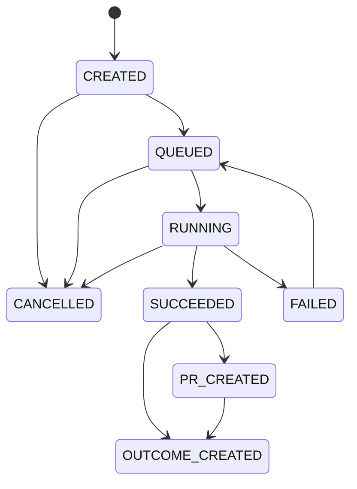

# Phase4 Audit Report

実施日: 2026-06-13

## 現状問題一覧

| 発見した問題 | 影響 | 修正内容 |
| --- | --- | --- |
| Codex Taskは文面保存だけだった | 実行・結果・PR・Outcomeへ進めない | Codex Task実行サービスとAPIを実装 |
| Codex Providerが`MockProvider`だった | Codex実行に見えるMock結果が生成される | Mock経路を削除し、実行パイプライン利用を強制 |
| Task一覧・詳細・履歴APIがなかった | 保存後の再表示・管理ができない | 一覧、詳細、検索、絞り込み、ページネーションAPIを実装 |
| 正式な状態モデルがなかった | 不正遷移・二重実行を防げない | DB制約、trigger、サービス遷移検証を実装 |
| 実行ログと変更ファイルが保存されなかった | 実行内容を監査・PR化できない | Executionテーブルとログ保存を実装 |
| Codex結果とPhase3 PRが接続されていなかった | 実装結果をレビューへ渡せない | Executionの変更ファイルをPhase3 GitHub経路へ接続 |
| Outcomeが実行結果・PR情報を持たなかった | 測定対象と実装内容が追跡できない | 実行概要、期待指標、関連PR、測定予定日を保存 |
| Codex生成課金が非冪等だった | 二重課金や失敗後の消費が起き得る | 冪等消費・補償RPCと処理別キーを実装 |
| 実行中キャンセルがなかった | 外部実行を停止・記録できない | Process終了、CANCELLED保存、クレジット補償を実装 |

## Codex Task状態設計

### 状態一覧

- `CREATED`
- `QUEUED`
- `RUNNING`
- `SUCCEEDED`
- `FAILED`
- `CANCELLED`
- `PR_CREATED`
- `OUTCOME_CREATED`

### 状態遷移図

DB triggerとBackendサービスの両方で、上図にない遷移を拒否します。`MOCK` executionは拒否します。

## 実装変更一覧

### DB migration

- `supabase/migrations/202606130001_phase4_codex_execution_workflow.sql`
  - `codex_task_prompts`状態・結果・PR・Outcome項目追加
  - `codex_task_executions`
  - `codex_task_status_history`
  - GitHub PRとCodex Task/Executionの関連
  - Outcomeの期待指標・測定予定日・実装概要
  - 冪等クレジット消費・補償RPC

### Backend services / API

- `backend/services/codex/codex_task_service.py`
- `backend/services/ai/providers/codex_execution_provider.py`
- `backend/services/ai/provider_registry.py`
- `backend/services/github/github_integration_service.py`
- `backend/services/github/github_api_client.py`
- `backend/services/outcomes/improvement_outcome_service.py`
- `backend/services/billing/credits.py`
- `backend/api/main.py`
- `backend/core/config.py`

### Frontend

- `frontend/app/codex-tasks/page.tsx`
- `frontend/app/codex-tasks/[taskId]/page.tsx`
- `frontend/hooks/use-codex-tasks.ts`
- `frontend/lib/api/codex.ts`
- `frontend/lib/types/adflow.ts`
- Sidebar、Header、改善提案からの遷移

## 動作確認結果

| 項目 | 結果 |
| --- | --- |
| Task作成 | 単体テストPASS。Apply Ready・REAL結果のみ許可 |
| 一覧取得・検索・絞り込み・ページネーション | 実装済み、型チェックPASS |
| 詳細取得 | 関連Improvement、Project、Ad、LP、Pair、履歴、Execution、PR、Outcomeを返却 |
| 状態更新・不正遷移 | 単体テストPASS、DB trigger migration作成済み |
| MANUAL_EXECUTION | 単体テストPASS。結果・ファイル・ログを保存 |
| REAL_EXECUTION | 実Codex CLIでPASS |
| 再実行 | FAILEDから再実行するテストPASS |
| キャンセル | CREATED・RUNNINGキャンセルと補償テストPASS |
| Mock禁止 | Codex ProviderとExecutionの双方でPASS |
| GitHub PR接続 | Phase3経路へ接続済み。実DB検証待ち |
| Outcome接続 | `PENDING_MEASUREMENT`ドラフト生成を実装。実DB検証待ち |
| 二重実行・二重課金防止 | idempotency test PASS |
| PR/Outcome/Execution失敗補償 | 単体テストPASS |
| Codex未設定 | Configuration API・UIで明示、REAL実行を拒否 |
| Backendテスト | 61件PASS |
| Backend import | PASS |
| Frontend型チェック | PASS |
| Frontend本番ビルド | PASS |
| `git diff --check` | PASS |

## 実行証跡

実Codex CLIを一時git repositoryと隔離worktreeで実行しました。

| 項目 | 実証値 |
| --- | --- |
| execution_mode | `REAL_EXECUTION` |
| status | `SUCCEEDED` |
| Codex CLI | `codex-cli 0.137.0-alpha.4` |
| files_changed | `phase4-proof.txt` |
| 内容 | `Phase4 real Codex execution verified.` |
| Mock利用 | なし |

## DB確認結果

接続中Supabaseでは、2026-06-13時点でPhase4 migrationは未適用です。

| 対象 | 現在の実DB結果 |
| --- | --- |
| `codex_task_executions` | `PGRST205`、未存在 |
| `codex_task_status_history` | `PGRST205`、未存在 |
| `consume_user_credits_idempotent` | `PGRST202`、未存在 |

適用対象:

`supabase/migrations/202606130001_phase4_codex_execution_workflow.sql`

## 未解決事項

1. Phase4 migrationを接続中Supabaseへ適用する必要があります。
2. migration適用後、実DB/APIでTask作成、Manual/Real実行結果、PR作成、Outcome作成、課金・補償、再読込維持を最終確認する必要があります。
3. 本番で`REAL_EXECUTION`を利用する場合、Backend実行環境へCodex CLIとgit checkoutを配置し、`CODEX_WORKSPACE`を設定する必要があります。未設定環境では正式な`MANUAL_EXECUTION`を利用できます。

## Phase5へ進めるか判定

**NO**

コード実装、実Codex CLI実行、Mock排除、回帰テストは完了しています。しかし、Phase4 migrationが実DBへ未適用のため、DB保存・API再取得・GitHub PR・Outcome・課金整合性の実証が完了していません。migration適用後の最終監査が必要です。
