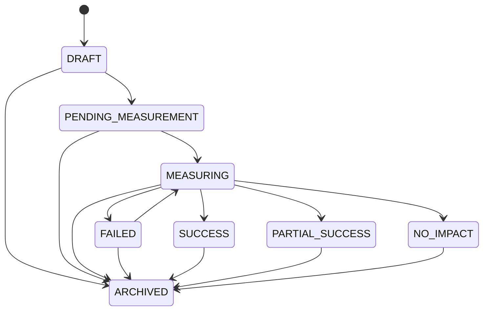

# Phase5 Audit Report

> **時点監査資料:** この文書の「現状問題一覧」は当該Phase開始時点の記録です。現在の状態は [`adflow-ai-current-state.md`](adflow-ai-current-state.md) と [`phase8-audit-report.md`](phase8-audit-report.md) を参照してください。

監査日: 2026-06-13

## 現状問題一覧

| 問題 | 影響 | 修正内容 |
| --- | --- | --- |
| Outcome状態が旧状態名で混在していた | 状態遷移と監査が一貫しない | 正式な8状態へ統一し、DB triggerとサービスで不正遷移を拒否 |
| Outcome状態変更履歴がなかった | 誰がいつ測定・評価したか追跡できない | `outcome_status_history`を追加 |
| Learning専用データがなかった | 成功・失敗施策を集計して次回分析へ戻せない | `outcome_learning_data`とLearning Engineを追加 |
| Outcome一覧・詳細・統計API/UIが不足していた | 横断的な成果管理ができない | 一覧、詳細、統計、Learning API/UIを追加 |
| 通常の提案オーケストレーションにCodexが混入していた | Codex Taskを経由せず分析が失敗する | 通常分析ルートからCodexを除外 |
| OpenAI Structured Outputsが任意JSON項目を含む推薦スキーマを拒否した | Learning読込後の次回分析が400で停止する | 不正スキーマ時のみ実AI JSON Object Modeへ切替え、Pydanticで再検証 |

## Outcome状態設計

- `DRAFT`
- `PENDING_MEASUREMENT`
- `MEASURING`
- `SUCCESS`
- `PARTIAL_SUCCESS`
- `NO_IMPACT`
- `FAILED`
- `ARCHIVED`

新規Outcomeは必ず`DRAFT`から開始します。状態変更時はDBとバックエンドの両方で遷移を検証し、変更者、変更日時、理由、測定ソースを履歴へ保存します。

## Learning設計

保存項目は`improvement_type`、`project_type`、`market_type`、Before/After指標、改善率、成功フラグ、信頼度、測定品質、Learningスコアです。

Learning対象は、比較可能なBefore/After指標を持ち、`SUCCESS`、`PARTIAL_SUCCESS`、`NO_IMPACT`、`FAILED`へ評価されたOutcomeです。元AI結果が`MOCK`のOutcome、未測定Outcome、比較可能な指標がないOutcomeは除外します。

保存されたLearningは、成功・失敗施策、平均改善率、カテゴリ別・市場別・Project別集計として取得され、次回のペア分析コンテキストへ渡されます。

## 実装変更一覧

### DB migration

- `supabase/migrations/202606130002_phase5_outcome_learning_loop.sql`
  - Outcome正式状態と測定項目
  - GitHub PR関連
  - `outcome_status_history`
  - `outcome_learning_data`
  - 状態遷移、履歴、重複防止

### Backend

- `backend/services/outcomes/improvement_outcome_service.py`
- `backend/services/outcomes/outcome_learning_engine.py`
- `backend/services/outcomes/outcome_connectors.py`
- `backend/services/demand/outcome_feedback_learning.py`
- `backend/services/analysis/registered_pair_analysis_service.py`
- `backend/services/ai/openai_json_client.py`
- `backend/services/orchestration/ai_orchestrator.py`
- `backend/services/x_ads/x_ads_service.py`
- `backend/api/main.py`

### Frontend

- `frontend/app/outcomes/page.tsx`
- `frontend/app/outcomes/[outcomeId]/page.tsx`
- `frontend/hooks/use-outcomes.ts`
- `frontend/lib/api/outcomes.ts`
- `frontend/lib/api/authenticated.ts`
- `frontend/components/auth/AuthGate.tsx`
- `frontend/playwright.config.ts`
- `frontend/e2e/outcomes.spec.ts`
- Dashboard、Sidebar、Pair詳細のOutcome表示

## 動作確認結果

| 確認項目 | 結果 |
| --- | --- |
| Outcome作成 | 実DBで確認。Improvement、Codex Task、GitHub PR起点に対応 |
| 結果記録 | 実DBでBefore/After、期間、方法、根拠を保存 |
| 成功判定 | CTR/CVR等の方向と閾値から`SUCCESS`を自動判定 |
| 失敗判定 | 悪化指標から`FAILED`を自動判定 |
| Learning保存 | 実DBに成功・失敗Learningを各1件保存 |
| Learning利用 | 次回ペア分析で成功`cta_change`、失敗`headline_change`を推薦・警告へ反映 |
| 一覧・詳細・統計API | Bearer認証付き実APIでHTTP 200 |
| フィルタ | `SUCCESS`フィルタで対象1件を取得 |
| 再読込維持 | API再取得で状態、履歴、Learningを維持 |
| 不正遷移 | `SUCCESS -> MEASURING`をDBで拒否 |
| 重複Outcome | 同一起点Outcomeを拒否 |
| データ欠損 | Before未設定を拒否 |
| 測定期間不足 | 評価を拒否 |
| Connector失敗 | X Ads証拠未接続時に失敗として返却 |
| X Ads Connector成功 | 実DBのリンク済み公開要求と2時点スナップショットから`SUCCESS`評価、履歴、Learning保存を確認 |
| ブラウザE2E | Playwrightで未認証リダイレクトと実Supabase認証後のOutcome画面表示を確認 |
| Backend tests | `70 passed` |
| Frontend production build | PASS、47 routes生成 |
| `git diff --check` | PASS |

## 学習データ確認

検証用ユーザー: `4960f629-d971-490d-8395-9a74df6415e2`

| データ | 実DB結果 |
| --- | --- |
| Outcome | 3件: `SUCCESS` 2、`FAILED` 1 |
| 状態履歴 | 12件 |
| Learning | 3件 |
| 次回分析 | 1件、`provider_type=REAL` |

X Ads Connector実証:

- Outcome ID: `6af64253-6de1-49b0-8c66-0265d5949bb5`
- 測定ソース: `X_ADS`
- Evidence: 2時点の実DBスナップショット
- 状態遷移: `DRAFT -> PENDING_MEASUREMENT -> MEASURING -> SUCCESS`
- Learning保存: 1件

成功施策:

- Outcome ID: `27d540b4-df43-4f3a-b5e0-20071ae48963`
- `cta_change`
- 改善率: `0.266667`
- 状態: `SUCCESS`

失敗施策:

- Outcome ID: `0bb8d359-1d7c-4711-a477-fbc29ef2bdf6`
- `headline_change`
- 改善率: `-0.327778`
- 状態: `FAILED`

次回分析では、CTA変更を優先候補として扱い、見出しの大幅変更を警告する結果を実際に取得しました。これにより、Learningが保存・表示だけでなく推薦生成に利用されることを確認しました。

## 未解決事項

Phase5の完了を妨げる未解決事項はありません。

- X Ads Outcome Connectorは、実DB上の監査用公開要求と2時点の指標スナップショットを使って成功経路を確認しました。外部X APIからの同期自体はOAuth接続が存在しないため未実施ですが、これはX Ads Integration運用時の接続試験であり、Outcome Connectorの保存・評価・Learning経路は確認済みです。
- Analyticsは現在連携先サービスが選定・設定されていません。Phase5要件の「現在未接続でも将来追加可能なConnector Layer」は`OutcomeConnectorRegistry`で満たしています。
- Playwright E2Eを導入し、未認証保護と実認証済みOutcome画面を自動確認しました。

## Phase6へ進めるか判定

**YES**

Phase5の完了条件である、Outcome作成、結果記録、自動評価、Learning保存、統計取得、次回改善提案へのLearning反映を実DBと実APIで確認しました。残課題は追加データソースの実証とブラウザE2Eであり、コアのOutcome Learningループを妨げるものではありません。
