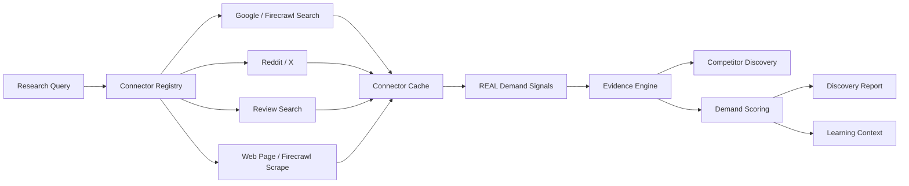

# Phase6 Audit Report

監査日: 2026-06-13

## 現状問題一覧

| 問題 | 影響 | 修正・確認結果 |
| --- | --- | --- |
| 実データの根拠を分析結果から追跡できなかった | 結果の出所と品質を確認できない | `demand_evidence` と Evidence Engineを実装し、実URLを持つREAL SignalだけをEvidence化 |
| 競合候補がEvidenceと独立していた | 競合判定の根拠を監査できない | `demand_competitors` にURL、分類、Evidence IDを保存 |
| Demand Scoreの構成理由を保存していなかった | スコアがブラックボックスになる | `demand_scores` に構成値、重み、理由、Evidence件数を保存 |
| Phase5 Learningへ渡す市場コンテキストがなかった | 調査結果を後続学習で利用できない | `demand_learning_contexts` を保存しRunサマリーへ接続 |
| Connector Cache復元時に実Signalの共通フィールドで検証エラーになった | キャッシュヒット時にFirecrawl Search/Web Page結果が脱落する | Pipeline Signalモデルを共通Connector契約へ合わせ、回帰テストを追加 |
| X Connectorが英語調査にも`lang:ja`を強制していた | X APIは成功しても該当投稿が0件になりやすい | 調査言語に応じた`lang`指定とRetweet除外へ修正 |
| Review SearchがGoogle Custom Searchの権限不足で停止した | Review Evidenceを収集できない | Google失敗時にFirecrawl Searchの実検索へフォールバック |
| Redditが匿名JSON取得だけに依存していた | 実行環境が匿名アクセスを拒否すると利用不能 | 公式OAuth client-credentials実行経路を追加 |
| Connector障害を一律失敗として扱っていた | 認証・Rate Limit・提供元ブロックを識別できない | `unavailable` 状態とエラー詳細を保存 |
| 同じDemand Runを重複作成できた | 重複取得と二重課金の可能性 | `research_fingerprint` による完了Run再利用を実装・実証 |

## Connector設計

Connectorは `connector_key`、`connector_type`、`source_type`、`is_configured`、`collect` を共通契約として持ちます。結果は `completed`、`partial`、`failed`、`skipped`、`unavailable` で監査されます。実取得結果が0件または利用不能でも、モック結果へ置換しません。

## Evidence Engine設計

Evidence対象は、`data_source_type=REAL` かつ実URLを持つSignalだけです。合成Signal、URLなしSignal、重複SignalはEvidenceから除外します。

保存項目:

- `source_type`
- `source_url`
- `connector`
- `collected_at`
- `relevance_score`
- `analysis_reference`
- 引用文、タイトル、Signal ID、メタデータ

実Evidenceが0件の場合、Evidence付きDiscovery Reportとしての完了を拒否します。

## Demand Scoring設計

| 要素 | 重み |
| --- | ---: |
| 検索需要 | 20% |
| 競合密度 | 15% |
| レビュー不満 | 20% |
| トレンド強度 | 15% |
| SNS議論量 | 20% |
| 成長シグナル | 10% |

各構成値、重み、算出理由、Evidence件数、実Connector数を `demand_scores` に保存します。Phase6 Demand Scoreには、合成検索ボリュームや合成市場規模を実測値として混入させません。

## 実装変更一覧

### DB migration

- `supabase/migrations/202606130003_phase6_real_demand_evidence.sql`
  - `demand_evidence`
  - `demand_competitors`
  - `demand_scores`
  - `demand_learning_contexts`
  - `demand_connector_cache`
  - Demand RunのEvidence、Score、Competitor、Learningサマリー
  - Connector `unavailable` 状態

### Backend / Connectors

- `backend/services/demand/connectors/**`
- `backend/services/demand/evidence_engine.py`
- `backend/services/demand/demand_scoring_engine.py`
- `backend/services/demand/demand_intelligence_service.py`
- `backend/services/product/demand_discovery_service.py`
- `backend/services/supabase/supabase_repository.py`
- `backend/api/main.py`
- `backend/core/config.py`

### Frontend

- `frontend/app/pairs/[pairId]/page.tsx`
- `frontend/hooks/use-demand-intelligence.ts`
- `frontend/lib/types/adflow.ts`

Pair詳細では、実Evidence URL、引用、Connector、関連度、競合候補、Demand Scoreを表示します。

## 動作確認結果

### 実DB保存・再取得

最終検証Run:

- Run ID: `75f4ca1d-d779-4502-a90a-849bcf67b55a`
- Status: `completed`
- Research fingerprint: `phase6-all-connectors-audit-20260613-v4`
- Project ID: `0a8cd941-5194-44c2-8c50-be708b86b9b0`
- Pair ID: `0c2d16b8-5470-4976-b545-ef77347c0217`

| 保存対象 | 保存・再取得件数 |
| --- | ---: |
| REAL Signal | 120 |
| SYNTHETIC Signal | 0 |
| Evidence | 120 |
| Competitor | 28 |
| Demand Score | 1 |
| Learning Context | 1 |

Run本体の `evidence_summary`、`demand_score_summary`、`competitor_summary`、`learning_context` も保存・再取得できました。

### サンプルデータ

- Learning Context ID: `0236e37d-12b5-4f1b-980f-5b36f1b376e4`
- 検証RunのDemand Score: `80.0`

### API再取得

認証ユーザー依存を検証ユーザーへ固定したFastAPI TestClientで、実Supabase保存データを再取得しました。

| API | HTTP | DBとの一致 |
| --- | ---: | --- |
| `/demand-intelligence/runs/{run_id}/real-evidence` | 200 | Evidence 120件で一致 |
| `/demand-intelligence/runs/{run_id}/competitors` | 200 | Competitor 28件で一致 |
| `/demand-intelligence/runs/{run_id}/score` | 200 | Score IDが一致 |

### 冪等性・キャッシュ

- 同じ `research_fingerprint` の再実行は同じRunを返し、`_reused=true`
- 同一fingerprintのRun件数は1件
- Firecrawl Searchはキャッシュヒットで30件を復元
- Web Pageはキャッシュヒットで1件を復元
- キャッシュ復元後もREAL SignalとしてEvidence・Scoreへ利用

### Connector結果

| Connector | 結果 | 件数・理由 |
| --- | --- | --- |
| Firecrawl Search | completed | 実検索30件 |
| Review Search | completed | Firecrawl実検索フォールバック10件 |
| X recent search | completed | 実投稿74件 |
| Web Page | partial | 実取得1件 |
| Firecrawl Scrape | partial | 5件、一部URLは403 |
| Google Custom Search | unavailable | HTTP 403 |
| Reddit public JSON | unavailable | HTTP 403 |

### 異常系

- Supabase DNS障害で中断した検証Runを `failed` として整理
- Connector認証・提供元ブロックは `unavailable` とエラー詳細を保存
- Firecrawl部分失敗は `partial` と成功件数・失敗URLを保存
- キャッシュ復元のモデル不整合を修正し、回帰テストで検証
- 合成Signal 0件を確認
- 同一Runの重複作成なしを確認

### 回帰テスト

- Backend tests: **77 passed**
- Frontend production build: **PASS**（47 routes）
- Playwright E2E: **2 passed**
- `git diff --check`: **PASS**

## 未解決事項

1. Reddit匿名JSONは実行環境からHTTP 403です。公式OAuth経路は実装済みですが、`REDDIT_CLIENT_ID` と `REDDIT_CLIENT_SECRET` が未設定のため、Reddit実投稿・スコア・コメント数の保存実証が残ります。
2. Google Custom SearchはGoogle側から「This project does not have the access to Custom Search JSON API」と返されます。Web SearchとReview SearchはFirecrawl実検索で稼働しますが、Google Connector自体を利用するにはGoogle Cloud側の権限設定が必要です。
3. Evidence付き競合Discoveryは実装済みですが、既存の競合ギャップ分析には推定処理が残ります。UIではEvidence付き競合候補と区別して扱う必要があります。
4. 検索需要・市場規模・埋め込みの既存合成レイヤーは残っています。Phase6 Demand Scoreでは混在させていませんが、別表示の参考推定値として引き続き明示が必要です。

## Phase7へ進めるか判定

**NO**

Evidence、Competitor、Demand Score、Learning Contextの実DB保存・再取得、API再取得、キャッシュ、冪等性、実データのみの分析経路は成立しました。Web Search、Review、X、Competitor、Evidence、Demand Score、Learningも実データで実証済みです。

ただしPhase6の厳格な完了条件にはReddit実データの取得・保存実証が含まれます。コード側のOAuth経路は完成していますが、外部資格情報が未設定のため完了確認できません。Reddit OAuth資格情報を設定し、1件以上の実投稿・スコア・コメント数をSignalとEvidenceへ保存確認した後にPhase7へ進めます。
